<div align="center">



[](https://platformops.srivantechnologies.com/)
[](https://platformops.srivantechnologies.com/#issues)
[](https://platformops.srivantechnologies.com/categories/)
[](https://platformops.srivantechnologies.com/Commands/KUBERNETES-COMMANDS/kubernetes-commands.html)
[](https://platformops.srivantechnologies.com/feed.xml)

**A technical newsletter on Kubernetes, OpenShift, SRE and platform engineering.**
Written from production systems, by [Vishal Abhinav](https://www.linkedin.com/in/vishal-abhinav/).
Published by [Srivan Technologies](https://srivantechnologies.com/).

</div>

---

## What this is

Every issue starts with something that broke, something that was slower than it
should have been, or something whose official explanation turned out to be
incomplete. The subject is the operational half of platform engineering:
Kubernetes and OpenShift, the Linux underneath them, the networking and storage
they depend on, and the observability that tells you which of those is lying to
you.

It assumes you already know what a Pod is. It does not assume the default
settings are correct.

**No paywall, no sign-in, no tracking beyond page counts, no AI-generated
filler.** Every page is readable without an account, the archive stays up, and
issues are corrected in place rather than silently replaced.

> **Newest — [Issue #067: Service Mesh Operations](https://platformops.srivantechnologies.com/Kubernetes/SERVICE-MESH-OPERATIONS/service-mesh-operations.html)**

---

## What it covers

685 topics across 45 categories, grouped into 13 pillars.
These are generated from the same file the site's knowledge map reads, so they
cannot disagree with what is actually published.

| Pillar | Categories | Live | Pipeline | Planned |
|:--|--:|--:|--:|--:|
| **Reliability** | 7 | 27 | 25 | 64 |
| **Commands** | 10 | 44 | 34 | 22 |
| **Delivery** | 6 | 12 | 22 | 42 |
| **Modern Ops** | 5 | 3 | 21 | 45 |
| **Data & Applications** | 4 | 1 | 12 | 47 |
| **Kubernetes & OpenShift** | 3 | 58 | 0 | 0 |
| **Security** | 2 | 0 | 18 | 28 |
| **System Design** | 1 | 0 | 0 | 46 |
| **Infrastructure** | 3 | 1 | 8 | 29 |
| **Networking** | 1 | 1 | 4 | 26 |
| **Roadmaps** | 1 | 0 | 0 | 18 |
| **Cloud** | 1 | 0 | 4 | 13 |
| **Foundation** | 1 | 7 | 0 | 3 |
| | **45** | **154** | **148** | **383** |

**Live** means a published page covers it. **Pipeline** means it sits next to a
series already running. **Planned** means it is on the backlog with no date
attached. Publishing the planned list is deliberate — a coverage map that only
shows what is finished tells you nothing about what the project is trying to be.

---

## Where to start

| | |
|:--|:--|
| [**Issue #067 — Service Mesh Operations**](https://platformops.srivantechnologies.com/Kubernetes/SERVICE-MESH-OPERATIONS/service-mesh-operations.html) | The newest issue. 21 in the archive. |
| [**Category hubs**](https://platformops.srivantechnologies.com/categories/) | Browse by subject. Each of the 45 categories has a generated architecture diagram and its full topic list. |
| [**Kubernetes &amp; OpenShift topic map**](https://platformops.srivantechnologies.com/categories/kubernetes-openshift-map/) | Check whether something specific is covered, queued or planned before spending time looking. |
| [**Command references**](https://platformops.srivantechnologies.com/Commands/KUBERNETES-COMMANDS/kubernetes-commands.html) | 4 references covering 362 commands, searchable and filterable. |
| [**Practice terminal**](https://platformops.srivantechnologies.com/terminal/) | A Unix shell simulated over an in-memory filesystem. Try the commands without a cluster. |
| [**Architecture**](https://platformops.srivantechnologies.com/architecture/) | The system end to end in seven diagrams — data flow, the build opened up, the PR path, the request path, deploy and rollback, trust boundaries. |
| [**About**](https://platformops.srivantechnologies.com/about/) | What this is, in more detail. |
| [**Colophon**](https://platformops.srivantechnologies.com/colophon/) | How the site is built, on the site. |

---

## How it is built

Static HTML generated by a Python build from one taxonomy file. No framework,
no client-side rendering, no build-time JavaScript, no dependencies beyond the
standard library.

That is not nostalgia. It means the counts on the homepage, in the category
hubs, in the topic map and in this README are all computed from one file at
build time — so they cannot drift apart, and a stage that would make them
disagree fails the build instead of shipping.

```
tools/      the build system         source, never published
content/    hand-written pages       source, never mutated
static/     copied verbatim          icons, OG cards, self-hosted fonts
    │
    ▼  tools/build.sh — sequential stages, set -euo pipefail
    ▼
dist/       everything the build makes — the only thing deployed
    │
    ▼  verify.py + test_render.py — no pass, no deploy
    ▼
GitHub Actions → Cloudflare Workers → platformops.srivantechnologies.com
```

**The build refuses to ship rather than ship something wrong.** Each of these
exists because the thing it checks actually went wrong at least once:

- Two consecutive builds must be **byte-identical**. Before the output
  directory existed, a clean build produced different output from an
  incremental one and nobody could tell.
- Every **internal link** must resolve, every page's **tags** must balance, and
  every **canonical** must point at itself.
- Every **category card** must agree with the hub page it links to — added
  after two pages described the same category differently, one click apart.
- The **security policy** is derived by walking the built pages for the origins
  they actually fetch from, and fails on one it does not recognise.
- **11 page families × 13 viewport widths** are opened in a real browser and
  asserted for horizontal overflow and duplicate fixed headers.
- CI **refuses to deploy** a build holding fewer than 500 pages, after a deploy
  from an empty directory once published a site where everything 404'd.

Drawn in full on the [architecture page](https://platformops.srivantechnologies.com/architecture/); the
stage-by-stage account is in the [colophon](https://platformops.srivantechnologies.com/colophon/).

---

## Running it

```bash
git clone https://github.com/Vishal-Abhinav/Platform-ops-Newsletter.git
cd Platform-ops-Newsletter
bash tools/build.sh          # writes dist/ — wait for: all checks passed
python3 -m http.server -d dist
```

Python 3.11+, standard library only. The render tests additionally want
`pip install playwright && playwright install chromium`.

---

## Who writes it

**Vishal Abhinav** — a platform engineer who spends his working days on the
systems this newsletter is about. The writing is first-hand: where an issue
describes a failure, it is a failure that happened; where it gives a number,
the number was measured rather than quoted.

[LinkedIn](https://www.linkedin.com/in/vishal-abhinav/) ·
[GitHub](https://github.com/Vishal-Abhinav) ·
[ResearchGate](https://www.researchgate.net/profile/Vishal-Abhinav/research) ·
[HackerRank](https://www.hackerrank.com/Vishal_Abhinav)

### Srivan Technologies

Platform Ops is published by **[Srivan Technologies](https://srivantechnologies.com/)** —
infrastructure and platform engineering. Kubernetes and OpenShift clusters, the
pipelines that deliver to them, and the observability that tells you what they
are actually doing.

*The layer most people only notice when it breaks.*

[srivantechnologies.com →](https://srivantechnologies.com/)

---

## Licence

Two licences, because the code and the writing are different things.

| What | Licence | In practice |
|:--|:--|:--|
| The build system and code samples | **MIT** | Use them, change them, ship them commercially. |
| The writing and the diagrams | **CC BY-NC-ND 4.0** | Quote it with credit and a link. Don't republish it wholesale, don't sell it, don't publish an edited version as the original. |

Want to do something the second licence doesn't allow — translate an issue, use
a diagram in training material, reprint a piece internally? Ask. The answer is
usually yes.

<div align="center">

**[Read Platform Ops →](https://platformops.srivantechnologies.com/)**

<sub>© 2026 Vishal Abhinav · Srivan Technologies · Built for engineers, by an engineer.</sub>

</div>
