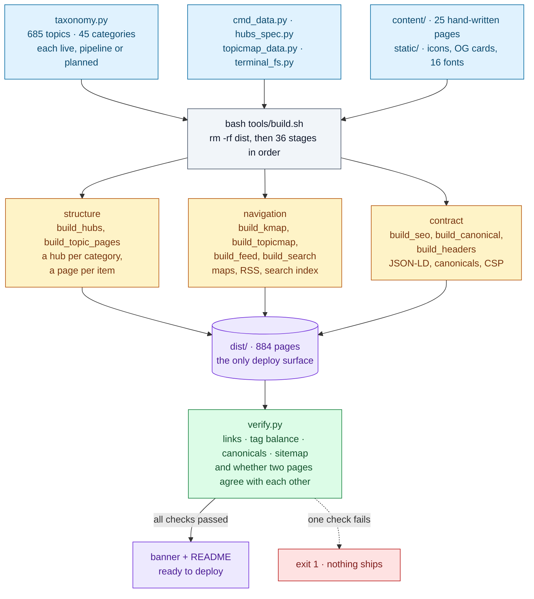
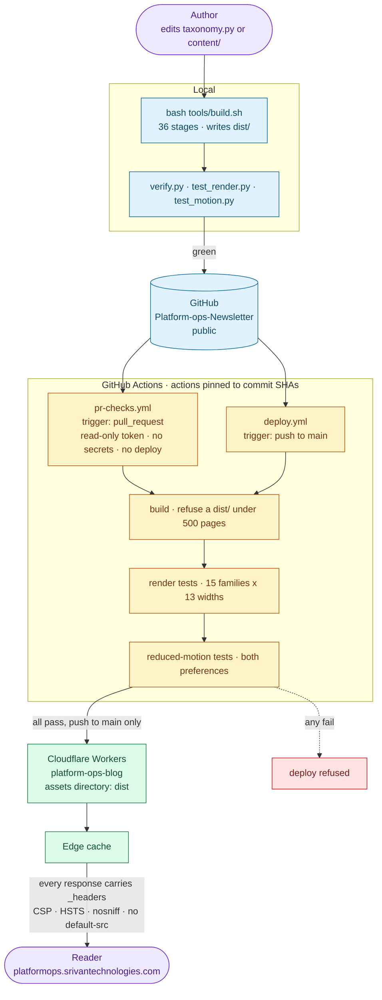
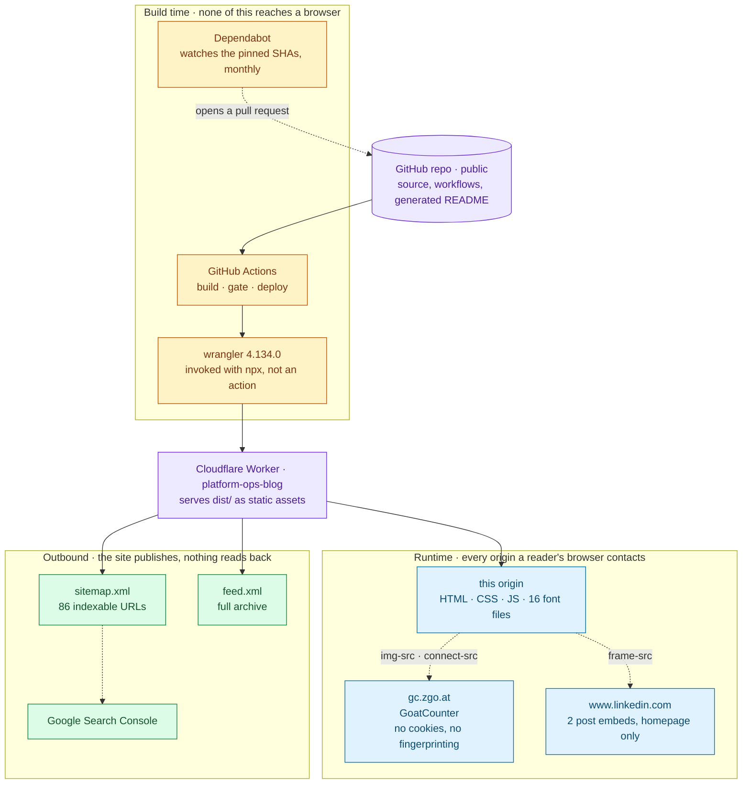

<div align="center">


[](https://platformops.srivantechnologies.com/)
[](https://platformops.srivantechnologies.com/issues/)
[](https://platformops.srivantechnologies.com/categories/)
[](https://platformops.srivantechnologies.com/Commands/KUBERNETES-COMMANDS/kubernetes-commands.html)
[](https://platformops.srivantechnologies.com/feed.xml)

**A technical newsletter on Kubernetes, OpenShift, SRE and platform engineering.**
Written from production systems, by [Vishal Abhinav](https://www.linkedin.com/in/vishal-abhinav/).
Published by [Srivan Technologies](https://srivantechnologies.com/).

</div>

---

## What this is

Every issue starts with something that broke, something that was slower than it
should have been, or something whose official explanation turned out to be
incomplete. The subject is the operational half of platform engineering:
Kubernetes and OpenShift, the Linux underneath them, the networking and storage
they depend on, and the observability that tells you which of those is lying to
you.

It assumes you already know what a Pod is. It does not assume the default
settings are correct.

**The newsletter and core reference library remain public, with no tracking beyond page
counts and no AI-generated filler.** Signed-in members also receive the isolated
operations path from Networking through Platform Engineering; the archive stays up
and issues are corrected in place.

> **Newest — [Issue #067: Service Mesh Operations](https://platformops.srivantechnologies.com/Kubernetes/SERVICE-MESH-OPERATIONS/service-mesh-operations.html)**

---

## What it covers

685 topics across 45 categories, grouped into 13 pillars.
These are generated from the same file the site's knowledge map reads, so they
cannot disagree with what is actually published.

| Pillar | Categories | Live | Pipeline | Planned |
|:--|--:|--:|--:|--:|
| **Reliability** | 7 | 27 | 25 | 64 |
| **Commands** | 10 | 44 | 34 | 22 |
| **Delivery** | 6 | 12 | 22 | 42 |
| **Modern Ops** | 5 | 3 | 21 | 45 |
| **Data & Applications** | 4 | 1 | 12 | 47 |
| **Kubernetes & OpenShift** | 3 | 58 | 0 | 0 |
| **Security** | 2 | 0 | 18 | 28 |
| **System Design** | 1 | 0 | 0 | 46 |
| **Infrastructure** | 3 | 1 | 8 | 29 |
| **Networking** | 1 | 1 | 4 | 26 |
| **Roadmaps** | 1 | 0 | 0 | 18 |
| **Cloud** | 1 | 0 | 4 | 13 |
| **Foundation** | 1 | 7 | 0 | 3 |
| | **45** | **154** | **148** | **383** |

**Live** means a published page covers it. **Pipeline** means it sits next to a
series already running. **Planned** means it is on the backlog with no date
attached. Publishing the planned list is deliberate — a coverage map that only
shows what is finished tells you nothing about what the project is trying to be.

---

## Where to start

| | |
|:--|:--|
| [**Issue #067 — Service Mesh Operations**](https://platformops.srivantechnologies.com/Kubernetes/SERVICE-MESH-OPERATIONS/service-mesh-operations.html) | The newest issue. 21 in the archive. |
| [**Category hubs**](https://platformops.srivantechnologies.com/categories/) | Browse by subject. Each of the 45 categories has a generated architecture diagram and its full topic list. |
| [**Kubernetes &amp; OpenShift topic map**](https://platformops.srivantechnologies.com/categories/kubernetes-openshift-map/) | Check whether something specific is covered, queued or planned before spending time looking. |
| [**Command references**](https://platformops.srivantechnologies.com/Commands/KUBERNETES-COMMANDS/kubernetes-commands.html) | 4 references covering 362 commands, searchable and filterable. |
| [**Practice terminal**](https://platformops.srivantechnologies.com/terminal/) | A Unix shell simulated over an in-memory filesystem. Try the commands without a cluster. |
| [**Architecture**](https://platformops.srivantechnologies.com/architecture/) | The system end to end in seven diagrams — data flow, the build opened up, the PR path, the request path, deploy and rollback, trust boundaries. |
| [**About**](https://platformops.srivantechnologies.com/about/) | What this is, in more detail. |
| [**Colophon**](https://platformops.srivantechnologies.com/colophon/) | How the site is built, on the site. |

---

## How it is built

Static HTML generated by a Python build from one taxonomy file. No framework,
no client-side rendering, no build-time JavaScript, no dependencies beyond the
standard library.

That is not nostalgia. It means the counts on the homepage, in the category
hubs, in the topic map and in this README are all computed from one file at
build time — so they cannot drift apart, and a stage that would make them
disagree fails the build instead of shipping.



**The build refuses to ship rather than ship something wrong.** Each of these
exists because the thing it checks actually went wrong at least once:

- Two consecutive builds must be **byte-identical**. Before the output
  directory existed, a clean build produced different output from an
  incremental one and nobody could tell.
- Every **internal link** must resolve, every page's **tags** must balance, and
  every **canonical** must point at itself.
- Every **category card** must agree with the hub page it links to — added
  after two pages described the same category differently, one click apart.
- The **security policy** is derived by walking the built pages for the origins
  they actually fetch from, and fails on one it does not recognise.
- **15 page families × 13 viewport widths** are
  opened in a real browser and asserted for horizontal overflow and duplicate
  fixed headers.
- **7 pages are loaded twice**, once under each motion
  preference, and asserted to stop animating without going invisible.
- CI **refuses to deploy** a build holding fewer than 500 pages, after a
  deploy from an empty directory once published a site where everything 404'd.

Drawn in full on the [architecture page](https://platformops.srivantechnologies.com/architecture/); the
stage-by-stage account is in the [colophon](https://platformops.srivantechnologies.com/colophon/).

---

## Repository layout

Three directories are input. One is output. Nothing else is either.

| Path | What it is |
|:--|:--|
| `tools/` | The build: 36 ordered stages, `verify.py`, and the browser test suites. Python 3.11, standard library only. |
| `content/` | The 25 hand-written pages, kept pristine — they are copied into `dist/` and edited *there*, never in place. |
| `static/` | Copied verbatim: icons, OG cards, 16 self-hosted font files, `assets/motion.css`. |
| `brand/` | The generated banner. Tracked, deliberately outside `static/`, so it never reaches the site. |
| `dist/` | **The only thing deployed.** Deleted and rebuilt from empty on every run. |

`dist/` is an allow-list, and that is the whole point: a file reaches the
public web only because a build stage deliberately wrote it there. The old
layout published from the repository root, where shipping something private
needed only an omission — which is how a full Mermaid install and a taxonomy
file once became fetchable. Now it needs a mistake in `tools/`.

---

## Tech stack

<div align="center">


</div>

| Layer | Choice | Why this one |
|:--|:--|:--|
| Build | **Python 3.11**, standard library | No dependency can break a build of a site that has to still build in five years. There is no `requirements.txt` for the build itself. |
| Output | **Static HTML**, no framework | Nothing to hydrate, nothing to server-render, nothing to keep patched. The slowest page is a file read. |
| Styling | Hand-written CSS, **16 self-hosted font files** | Bebas Neue, Manrope, DM Mono, Instrument Serif — served from this origin, so `font-src` is `'self'` and no third party sees a reader. |
| Tests | **Playwright** + Chromium | Overflow, duplicate headers and motion are properties of a rendered page. Reading the HTML cannot see any of them. |
| CI | **GitHub Actions**, pinned to commit SHAs | A moved tag cannot change what runs. Dependabot watches the pins so they still get security fixes. |
| Deploy | **Cloudflare Workers**, `wrangler@4.134.0` via `npx` | Pinned exactly, and called directly rather than through an action that quietly resolved a different version. |
| Analytics | **GoatCounter** | No cookies, no fingerprinting, no consent banner to show anyone. |
| Diagrams | **Mermaid** in the README, hand-built SVG on the site | GitHub renders Mermaid natively, so these diagrams are text in the repo and cannot drift out of sync as images. |

---

## Architecture

### End to end — a change, from an edit to a reader



A pull request from a fork runs the same build and the same gates, and then
stops. Only a push to `main` reaches the deploy step, and only that step is
given the Cloudflare credentials.

### Integrations — every system this touches, and which way data moves



Two origins in that runtime box are not this one, and both are in the CSP by
name because the build found them there. Everything else a reader loads —
every stylesheet, every script, all 16 font files — comes from this
origin. The same system drawn at greater depth, including the request path and
the trust boundaries, is on the [architecture page](https://platformops.srivantechnologies.com/architecture/).

---

## Security

The public knowledge surface is static and runs no third-party JavaScript.
Optional private account pages use a small Worker, GitHub OAuth, a hashed
session cookie, and D1 role records; public reading still requires no account.
Signup opens a normal user workspace immediately. Admin remains restricted to
the configured Vishal email.

**The policy is derived, not written.** `build_headers.py` walks the built
pages for the origins they actually fetch from and emits `dist/_headers`. Two
are allowed — `gc.zgo.at` for privacy-preserving analytics, `www.linkedin.com`
for the two post embeds. A page that starts fetching from anywhere else fails
the build rather than silently widening the policy.

The header it generates:

```
Content-Security-Policy: font-src 'self'; frame-src 'self' https://www.linkedin.com;
  img-src 'self' data: https://gc.zgo.at; connect-src 'self' https://gc.zgo.at;
  frame-ancestors 'none'; base-uri 'none'; object-src 'none'; form-action 'self';
  upgrade-insecure-requests
Strict-Transport-Security: max-age=63072000; includeSubDomains; preload
X-Content-Type-Options: nosniff
Referrer-Policy: strict-origin-when-cross-origin
Permissions-Policy: accelerometer=(), camera=(), geolocation=(), microphone=(), payment=(), usb=()
Cross-Origin-Opener-Policy: same-origin
```

There is deliberately **no `default-src`**, and that is the load-bearing
decision in the file. `default-src` is a *fallback*, not a baseline: every
fetch directive left out inherits it. `default-src 'self'` with `script-src`
absent therefore means `script-src 'self'`, which would block every inline
`<script>` and every `onclick` handler on the site — several hundred of them.
The comment explaining this sits above the constant, because it looks wrong
and reads as an omission.

A `script-src` that actually constrains scripts is the open item, and it is
open honestly: closing it means moving those inline handlers out to files
first. It is tracked, not forgotten.

**Fonts are self-hosted.** 16 files under `static/assets/fonts/`, so
there is no request to a third party on any page view and no `font-src`
beyond `'self'`.

**Supply chain.** Every GitHub Action is pinned to a full commit SHA with the
version in a trailing comment, so a moved tag cannot change what runs. PR
checks are `pull_request`, never `pull_request_target` — the workflow that
runs a contributor's code has a read-only token, no `secrets:` block and no
deploy step. There is nothing in it to leak.

Found something? Open a [security advisory](https://github.com/Vishal-Abhinav/Platform-ops-Newsletter/security/advisories/new)
rather than a public issue.

---

## Accessibility

Honoured on all 884 pages, and tested rather than asserted.

The site animates: a drifting background, pulsing status dots, a ticker, a
blinking terminal cursor, a staggered typewriter reveal, counters that count
up. Until September 2026 every one of those ran regardless of what the reader
had asked their operating system for — twelve distinct infinite animations,
`prefers-reduced-motion` honoured on zero pages.

It now resolves in three places, because no one of them is enough:

- `assets/motion.css`, on all 884 pages, collapses every CSS animation
  and transition to `0.01ms` with a single iteration — **not** `animation:
  none`. Several entrances start at `opacity: 0`; removing the animation
  outright would leave that content permanently invisible, which is a worse
  bug than the motion it fixes. A near-zero duration lets every animation
  reach its *final* keyframe immediately.
- The homepage typewriter and counters are driven by `setTimeout` and
  `setInterval`, which no stylesheet can reach, so they check the same media
  query in JavaScript and jump straight to their finished state — every line
  shown, every counter on its real total.
- SVG **SMIL** — `<animateMotion>` and friends — is not CSS, so no stylesheet
  can stop it, and `getAnimations()` does not report it either. That
  combination is why it went unnoticed: the suite below asked the browser what
  was animating, the browser said nothing was, and the particles kept flying
  for a reader who had asked them not to. `build_seo.py` now injects an
  explicit `pauseAnimations()` call into any page carrying SMIL, and
  `verify.py` asserts across all 884 pages that a page which can animate
  this way can also stop.

`tools/test_motion.py` opens 7 pages twice, once under each
preference, and asserts that nothing is still animating, nothing was left
invisible, nothing is frozen part-way through a reveal, and no counter is
stuck mid-count. It also samples where everything inside every `<svg>`
actually *is*, twice, a second apart — because asking the browser what is
animating is exactly the question that missed SMIL, and asking whether
anything moved cannot be fooled by the technique. It also asserts that the motion **is still there** without the
preference — a test that only checked the reduced case would pass just as
happily on a site whose animation had been deleted.

Also measured across all 884 pages, rather than asserted: exactly one
`<h1>` each, a `lang` attribute on every `<html>`, a `<nav>` landmark, and no
icon-only control left without an `aria-label`. Colour is never the only thing
carrying a meaning — the live/pipeline/planned states that colour the coverage
bars are written out in words beside them.

**What is still wrong, stated plainly**, because an accessibility section that
lists only its wins is marketing:

- There is **no `<main>` landmark and no skip link** — on any page. A
  screen-reader user cannot jump to the content, and a keyboard user tabs
  through the whole navigation to reach it, on every page, every time. This
  is the largest remaining barrier here and it is not a small fix: the page
  families do not share one content wrapper, so it needs doing per family
  and re-verifying, not a regex across the build.
- **Focus styling relies on the browser default**, and two pages remove it
  with `outline: none` — which is worse than not styling it at all.
- **Contrast has not been measured systematically.** It was chosen by eye
  against WCAG AA, which is not the same as having checked.

Something here not working for you? That is a bug, and a welcome one to
receive. Please open an issue.

---

## Machine-readable

| File | What it holds |
|:--|:--|
| [`/sitemap.xml`](https://platformops.srivantechnologies.com/sitemap.xml) | 86 indexable URLs. Pages carrying `noindex` are deliberately withheld — a sitemap is a request to crawl, and listing a page that then declines to be indexed just spends crawl budget. |
| [`/feed.xml`](https://platformops.srivantechnologies.com/feed.xml) | RSS, full archive. |
| [`/robots.txt`](https://platformops.srivantechnologies.com/robots.txt) | Crawl rules and the sitemap pointer. |
| `/_headers` | Generated per build; see Security above. |

---

## Running it

```bash
git clone https://github.com/Vishal-Abhinav/Platform-ops-Newsletter.git
cd Platform-ops-Newsletter
bash tools/build.sh          # writes dist/ — wait for: all checks passed
python3 -m http.server -d dist
```

Python 3.11+, standard library only. The browser suites additionally want
`pip install playwright && playwright install chromium`:

```bash
python3 tools/verify.py              # links, tags, canonicals, cross-page agreement
python3 tools/test_render.py dist    # 12 page families x 13 widths
python3 tools/test_motion.py dist    # both motion preferences
```

---

## Contributing

Corrections are welcome and wanted — especially "this does not match what I
see in production", which is the most useful issue anyone can file. Please
include the version, the platform and what you observed.

Two things worth knowing before a pull request:

**Never edit anything in `dist/`.** It is deleted and regenerated on every
build, so a change made there is gone the moment anyone runs `tools/build.sh`.
Edit the source in `tools/`, `content/` or `static/` and rebuild.

**`README.md` and `brand/` are generated.** They are built by
`tools/build_ghreadme.py` and `tools/make_banner.py` from the taxonomy. Editing
this file by hand works exactly until the next build overwrites it — and CI
fails the PR if either is stale, so run `bash tools/build.sh` and commit the
result.

CI runs the full build, refuses a `dist/` holding fewer than 500 pages, and
runs the render tests on every pull request. Running the three commands above
locally first is the quickest way to know it will pass.

Prose changes want an issue before a PR — the writing is first-hand and
opinionated by design, and the licence on it is narrower than the one on the
code. See below.

---

## Who writes it

**Vishal Abhinav** — a platform engineer who spends his working days on the
systems this newsletter is about. The writing is first-hand: where an issue
describes a failure, it is a failure that happened; where it gives a number,
the number was measured rather than quoted.

[LinkedIn](https://www.linkedin.com/in/vishal-abhinav/) ·
[GitHub](https://github.com/Vishal-Abhinav) ·
[ResearchGate](https://www.researchgate.net/profile/Vishal-Abhinav/research) ·
[HackerRank](https://www.hackerrank.com/Vishal_Abhinav)

### Srivan Technologies

Platform Ops is published by **[Srivan Technologies](https://srivantechnologies.com/)** —
infrastructure and platform engineering. Kubernetes and OpenShift clusters, the
pipelines that deliver to them, and the observability that tells you what they
are actually doing.

*The layer most people only notice when it breaks.*

[srivantechnologies.com →](https://srivantechnologies.com/)

---

## Licence

Two licences, because the code and the writing are different things.

| What | Licence | In practice |
|:--|:--|:--|
| The build system and code samples | **MIT** | Use them, change them, ship them commercially. |
| The writing and the diagrams | **CC BY-NC-ND 4.0** | Quote it with credit and a link. Don't republish it wholesale, don't sell it, don't publish an edited version as the original. |

Full text in [`LICENSE`](LICENSE); the attribution terms and the third-party
credits — fonts and analytics — are in [`NOTICE`](NOTICE).

Want to do something the second licence doesn't allow — translate an issue, use
a diagram in training material, reprint a piece internally? Ask. The answer is
usually yes.

<div align="center">

**[Read Platform Ops →](https://platformops.srivantechnologies.com/)**

<sub>© 2026 Vishal Abhinav · Srivan Technologies · Built for engineers, by an engineer.</sub>

</div>
