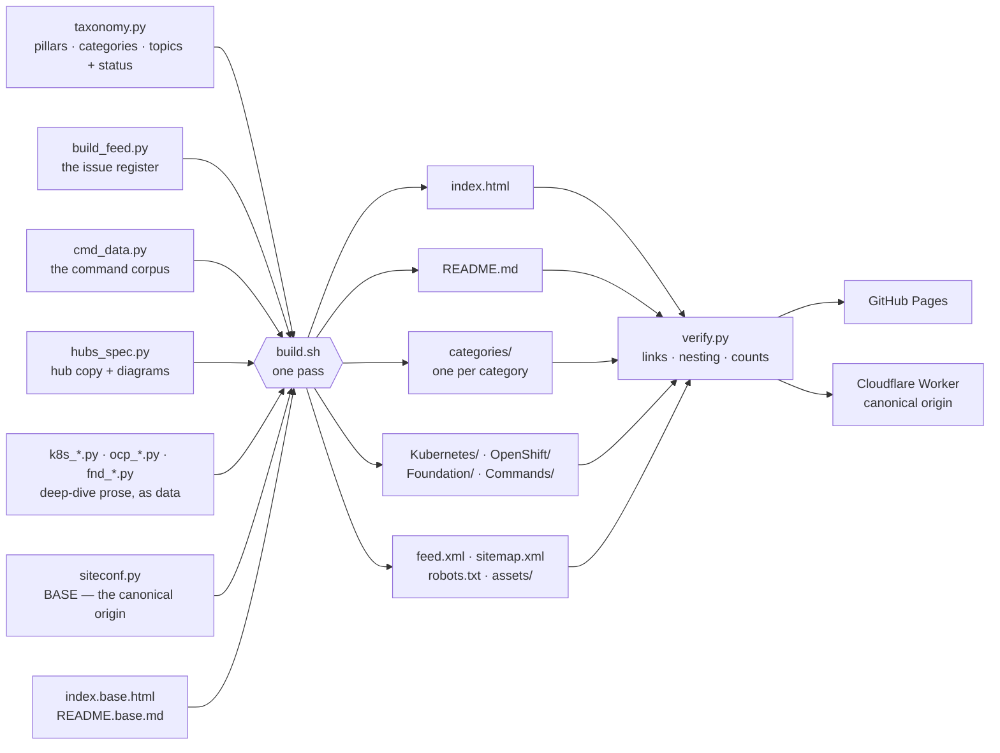

<div align="center">

```
╔═══════════════════════════════════════════════════════════════════════════╗
║                                                                           ║
║   ██████╗ ██╗      █████╗ ████████╗███████╗ ██████╗ ██████╗ ███╗   ███╗   ║
║   ██╔══██╗██║     ██╔══██╗╚══██╔══╝██╔════╝██╔═══██╗██╔══██╗████╗ ████║   ║
║   ██████╔╝██║     ███████║   ██║   █████╗  ██║   ██║██████╔╝██╔████╔██║   ║
║   ██╔═══╝ ██║     ██╔══██║   ██║   ██╔══╝  ██║   ██║██╔══██╗██║╚██╔╝██║   ║
║   ██║     ███████╗██║  ██║   ██║   ██║     ╚██████╔╝██║  ██║██║ ╚═╝ ██║   ║
║   ╚═╝     ╚══════╝╚═╝  ╚═╝   ╚═╝   ╚═╝      ╚═════╝ ╚═╝  ╚═╝╚═╝     ╚═╝   ║
║                                                                           ║
║                      O P S   ×   N E W S L E T T E R                      ║
║                  Tech with Vishal Abhinav  ·  Open Source                 ║
║                                                                           ║
╚═══════════════════════════════════════════════════════════════════════════╝
```

---


<br/>

**A free, open-source knowledge base for DevOps Engineers, SREs, and Platform Builders.**
*Deep-dive issues · Architecture diagrams · Runbooks · A 190-term Linux & Unix glossary.*

### 🌐 **[Read it live → platformops.srivantechnologies.com](https://platformops.srivantechnologies.com/)**

[📚 Issues](#-published-issues) · [📖 Library](#-reference-library) · [🗺️ Knowledge Map](#️-knowledge-map) · [🗂️ Structure](#️-repository-structure) · [🚀 Run Locally](#-quick-start)

</div>

---

## 🧭 What is This?

> *"I write the runbooks I wish existed the first time something broke at 2 AM."*

**Platform Ops** is a monthly technical newsletter covering the **Platform Engineering, Kubernetes, SRE and Infrastructure** stack — written by one practitioner working in production, not slideware.

This repository *is* the newsletter. Every issue is a self-contained HTML page served straight from GitHub Pages — no build step, no framework, no tracking. Fork it, read it offline, or lift a diagram for your own docs.

**Currently in this repo:** 21 monthly issue pages, 5 Foundation reference deep-dives, 4 command references covering 362 commands, a 190-term Linux & Unix glossary with 12 standalone term pages, 831 category pages, 2 section hubs and a homepage index — 879 pages in total.

---

## 🗺️ Knowledge Map

The **2026 master map** — every subject this newsletter intends to cover, in one place.
685 topics, grouped into 45 categories and 13 pillars. The homepage renders
this same map with search and status filters; both are generated from one source
of truth, so the numbers here and there can never disagree.

| | Pillar | Categories | ✅ Live | 🔸 Pipeline | · Planned | Total |
|:--|:--|--:|--:|--:|--:|--:|
| `01` | **Foundation** | 1 | 7 | 0 | 3 | 10 |
| `02` | **Roadmaps** | 1 | 0 | 0 | 18 | 18 |
| `03` | **Infrastructure** | 3 | 1 | 8 | 29 | 38 |
| `04` | **Networking** | 1 | 1 | 4 | 26 | 31 |
| `05` | **Cloud** | 1 | 0 | 4 | 13 | 17 |
| `06` | **Delivery** | 6 | 12 | 22 | 42 | 76 |
| `07` | **Kubernetes & OpenShift** | 3 | 58 | 0 | 0 | 58 |
| `08` | **Reliability** | 7 | 27 | 25 | 64 | 116 |
| `09` | **Security** | 2 | 0 | 18 | 28 | 46 |
| `10` | **Data & Applications** | 4 | 1 | 12 | 47 | 60 |
| `11` | **System Design** | 1 | 0 | 0 | 46 | 46 |
| `12` | **Commands** | 10 | 44 | 34 | 22 | 100 |
| `13` | **Modern Ops** | 5 | 3 | 21 | 45 | 69 |
| | **Total** | **45** | **154** | **148** | **383** | **685** |

**Status meanings**

| | Meaning |
|:--|:--|
| ✅ **Live** | A published issue covers it, and the topic links straight to that page. |
| 🔸 **Pipeline** | Next up — adjacent to a series already running, so it's queued rather than hypothetical. |
| · **Planned** | On the backlog. No date attached; it moves to pipeline when the series in front of it lands. |

Live topics point at the 30 deep-dives already in this repo — 21 monthly issues plus the
Foundation reference pages — so one page can light up several topics at once. Issue #051 alone
covers Prometheus, Grafana, Loki, Jaeger and distributed tracing; #062 covers ConfigMaps,
Secrets, Namespaces and RBAC.

<br>

<details>
<summary><b>01 · Foundation</b> — 1 category · 7 live · 0 pipeline · 3 planned</summary>

**🧱 Foundation** — 7 live · 0 pipeline · 3 planned  
✅ [Computer Fundamentals](./Foundation/COMPUTER-FUNDAMENTALS/computer-fundamentals.html) &nbsp;
✅ [Operating Systems](./Foundation/OPERATING-SYSTEMS/operating-systems.html) &nbsp;
✅ [Linux](./Infrastructure/OS/LINUX/FUNDAMENTALS/linux-fundamentals.html) &nbsp;
✅ [Unix](./Infrastructure/OS/LINUX/GLOSSARY/linux-unix-glossary.html) &nbsp;
· Windows Server &nbsp;
✅ [Shell & Bash](./Foundation/SHELL-AND-BASH/shell-and-bash.html) &nbsp;
✅ [Python](./Foundation/PYTHON/python.html) &nbsp;
· Programming Fundamentals &nbsp;
· Data Structures & Algorithms &nbsp;
✅ [Git & Version Control](./Foundation/GIT-VERSION-CONTROL/git-version-control.html) &nbsp;

</details>

<details>
<summary><b>02 · Roadmaps</b> — 1 category · 0 live · 0 pipeline · 18 planned</summary>

**🧭 Roadmaps** — 0 live · 0 pipeline · 18 planned  
· Linux / Systems Administrator &nbsp;
· DevOps Engineer &nbsp;
· Site Reliability Engineer &nbsp;
· Platform Engineer &nbsp;
· Cloud Engineer &nbsp;
· Cloud Architect &nbsp;
· Kubernetes Administrator &nbsp;
· Network Engineer &nbsp;
· Security Engineer &nbsp;
· DevSecOps Engineer &nbsp;
· Database Administrator &nbsp;
· Data Engineer &nbsp;
· MLOps Engineer &nbsp;
· Observability Engineer &nbsp;
· Release / Build Engineer &nbsp;
· FinOps Engineer &nbsp;
· Solutions Architect &nbsp;
· NOC / Support Engineer &nbsp;

</details>

<details>
<summary><b>03 · Infrastructure</b> — 3 categories · 1 live · 8 pipeline · 29 planned</summary>

**🏗️ IT Infrastructure** — 0 live · 5 pipeline · 7 planned  
🔸 IT Infrastructure &nbsp;
🔸 Server Administration &nbsp;
· Hardware &nbsp;
· Data Center &nbsp;
· Rack / Power / Cooling &nbsp;
🔸 Capacity Planning &nbsp;
🔸 High Availability &nbsp;
· Fault Tolerance &nbsp;
🔸 Disaster Recovery &nbsp;
· Business Continuity &nbsp;
· Infrastructure Architecture &nbsp;
· Enterprise Infrastructure &nbsp;

**💽 Storage** — 1 live · 2 pipeline · 12 planned  
🔸 Storage Fundamentals &nbsp;
· Local Storage &nbsp;
· RAID &nbsp;
✅ [LVM](./Infrastructure/OS/LINUX/ADVANCED/linux-advanced.html) &nbsp;
· SAN &nbsp;
· NAS &nbsp;
· NFS &nbsp;
· SMB / CIFS &nbsp;
· Object Storage &nbsp;
· Block Storage &nbsp;
· File Storage &nbsp;
· Storage Replication &nbsp;
· Storage Performance &nbsp;
· Storage Backup &nbsp;
🔸 Storage Troubleshooting &nbsp;

**🖥️ Virtualization** — 0 live · 1 pipeline · 10 planned  
🔸 Virtualization Fundamentals &nbsp;
· VMware &nbsp;
· ESXi &nbsp;
· vCenter &nbsp;
· KVM &nbsp;
· QEMU &nbsp;
· Hyper-V &nbsp;
· Virtual Networking &nbsp;
· Virtual Storage &nbsp;
· VM Lifecycle &nbsp;
· VM HA / DR &nbsp;

</details>

<details>
<summary><b>04 · Networking</b> — 1 category · 1 live · 4 pipeline · 26 planned</summary>

**🌐 Networking** — 1 live · 4 pipeline · 26 planned  
🔸 Networking Fundamentals &nbsp;
🔸 OSI Model &nbsp;
🔸 TCP/IP &nbsp;
· IPv4 &nbsp;
· IPv6 &nbsp;
· Subnetting &nbsp;
· VLAN &nbsp;
· Switching &nbsp;
· Routing &nbsp;
· BGP &nbsp;
· OSPF &nbsp;
· EIGRP &nbsp;
· MPLS &nbsp;
· ARP &nbsp;
· ICMP &nbsp;
· TCP &nbsp;
· UDP &nbsp;
✅ [DNS](./DevOps/K8/Networking/k8-networking.html) &nbsp;
· DHCP &nbsp;
· NAT &nbsp;
· Proxy &nbsp;
· VPN &nbsp;
· IPSec &nbsp;
🔸 Load Balancing &nbsp;
· Network Security &nbsp;
· Firewall &nbsp;
· WAF &nbsp;
· SDN &nbsp;
· SD-WAN &nbsp;
· Network Automation &nbsp;
· Network Monitoring &nbsp;

</details>

<details>
<summary><b>05 · Cloud</b> — 1 category · 0 live · 4 pipeline · 13 planned</summary>

**☁️ Cloud** — 0 live · 4 pipeline · 13 planned  
🔸 Cloud Fundamentals &nbsp;
🔸 AWS &nbsp;
🔸 Microsoft Azure &nbsp;
· Google Cloud &nbsp;
· Cloud Networking &nbsp;
· Cloud Compute &nbsp;
· Cloud Storage &nbsp;
· Cloud Databases &nbsp;
· Cloud IAM &nbsp;
· Cloud Security &nbsp;
· Cloud Monitoring &nbsp;
· Cloud Backup &nbsp;
· Cloud DR &nbsp;
🔸 Hybrid Cloud &nbsp;
· Multi-Cloud &nbsp;
· Cloud Migration &nbsp;
· Cloud Architecture &nbsp;

</details>

<details>
<summary><b>06 · Delivery</b> — 6 categories · 12 live · 22 pipeline · 42 planned</summary>

**⚙️ DevOps** — 9 live · 5 pipeline · 7 planned  
🔸 DevOps Fundamentals &nbsp;
· DevOps Culture &nbsp;
✅ [CI/CD](./DevOps/CICD/cicd-pipelines.html) &nbsp;
✅ [Continuous Integration](./DevOps/CICD/cicd-pipelines.html) &nbsp;
✅ [Continuous Delivery](./DevOps/CICD/cicd-pipelines.html) &nbsp;
✅ [Continuous Deployment](./DevOps/CICD/cicd-pipelines.html) &nbsp;
✅ [Jenkins](./DevOps/CICD/cicd-pipelines.html) &nbsp;
✅ [GitLab CI/CD](./DevOps/CICD/cicd-pipelines.html) &nbsp;
🔸 GitHub Actions &nbsp;
· Azure DevOps &nbsp;
· Build Automation &nbsp;
· Artifact Management &nbsp;
· Release Automation &nbsp;
✅ [Deployment Strategies](./DevOps/CICD/cicd-pipelines.html) &nbsp;
✅ [Blue/Green Deployment](./DevOps/CICD/cicd-pipelines.html) &nbsp;
✅ [Canary Deployment](./DevOps/CICD/cicd-pipelines.html) &nbsp;
🔸 Rolling Deployment &nbsp;
🔸 Rollback &nbsp;
· Feature Flags &nbsp;
🔸 Pipeline Security &nbsp;
· Pipeline Optimization &nbsp;

**📦 Containers** — 0 live · 6 pipeline · 6 planned  
🔸 Containers &nbsp;
🔸 Docker &nbsp;
· Podman &nbsp;
· Containerd &nbsp;
· CRI &nbsp;
· OCI &nbsp;
🔸 Container Images &nbsp;
· Container Registries &nbsp;
🔸 Container Networking &nbsp;
· Container Storage &nbsp;
🔸 Container Security &nbsp;
🔸 Container Troubleshooting &nbsp;

**📐 Infrastructure as Code** — 0 live · 3 pipeline · 8 planned  
🔸 Infrastructure as Code &nbsp;
🔸 Terraform &nbsp;
· OpenTofu &nbsp;
· Pulumi &nbsp;
· Terraform Modules &nbsp;
🔸 Terraform State &nbsp;
· Remote State &nbsp;
· Terraform Providers &nbsp;
· IaC Security &nbsp;
· IaC Testing &nbsp;
· IaC Drift Management &nbsp;

**🔧 Configuration Management** — 0 live · 3 pipeline · 9 planned  
🔸 Configuration Management &nbsp;
🔸 Ansible &nbsp;
🔸 Ansible Playbooks &nbsp;
· Roles &nbsp;
· Inventories &nbsp;
· Variables &nbsp;
· Templates &nbsp;
· Ansible Vault &nbsp;
· AWX / Automation Platform &nbsp;
· Puppet &nbsp;
· Chef &nbsp;
· Salt &nbsp;

**🔀 GitOps** — 3 live · 2 pipeline · 3 planned  
✅ [GitOps](./DevOps/CICD/cicd-pipelines.html) &nbsp;
✅ [Argo CD](./DevOps/CICD/cicd-pipelines.html) &nbsp;
✅ [Flux](./DevOps/CICD/cicd-pipelines.html) &nbsp;
🔸 Git-based Infrastructure &nbsp;
🔸 Declarative Deployment &nbsp;
· Drift Detection &nbsp;
· Progressive Delivery &nbsp;
· GitOps Security &nbsp;

**🛠️ Platform Engineering** — 0 live · 3 pipeline · 9 planned  
🔸 Platform Engineering &nbsp;
🔸 Internal Developer Platform &nbsp;
· Developer Experience &nbsp;
· Self-Service Infrastructure &nbsp;
· Golden Paths &nbsp;
· Platform-as-a-Product &nbsp;
🔸 Backstage &nbsp;
· Developer Portals &nbsp;
· Platform APIs &nbsp;
· Platform Governance &nbsp;
· Platform Automation &nbsp;
· Platform Security &nbsp;

</details>

<details>
<summary><b>07 · Kubernetes & OpenShift</b> — 3 categories · 58 live · 0 pipeline · 0 planned</summary>

**☸️ Kubernetes** — 35 live · 0 pipeline · 0 planned  
✅ [Kubernetes Fundamentals](./DevOps/K8/ARCHITECTURE/k8-architecture.html) &nbsp;
✅ [Kubernetes Architecture](./DevOps/K8/ARCHITECTURE/k8-architecture.html) &nbsp;
✅ [Pods](./DevOps/K8/ARCHITECTURE/k8-architecture.html) &nbsp;
✅ [Deployments](./DevOps/K8/ARCHITECTURE/k8-architecture.html) &nbsp;
✅ [ReplicaSets](./Kubernetes/KUBERNETES-WORKLOADS/kubernetes-workloads.html) &nbsp;
✅ [DaemonSets](./Kubernetes/KUBERNETES-WORKLOADS/kubernetes-workloads.html) &nbsp;
✅ [StatefulSets](./DevOps/K8/STORAGE/k8-storage.html) &nbsp;
✅ [Jobs / CronJobs](./Kubernetes/KUBERNETES-WORKLOADS/kubernetes-workloads.html) &nbsp;
✅ [Services](./DevOps/K8/Networking/k8-networking.html) &nbsp;
✅ [Ingress](./DevOps/K8/Networking/k8-networking.html) &nbsp;
✅ [ConfigMaps](./Kubernetes/KUBERNETES-CONFIG-AND-ACCESS/kubernetes-config-and-access.html) &nbsp;
✅ [Secrets](./Kubernetes/KUBERNETES-CONFIG-AND-ACCESS/kubernetes-config-and-access.html) &nbsp;
✅ [Volumes](./DevOps/K8/STORAGE/k8-storage.html) &nbsp;
✅ [Persistent Volumes](./DevOps/K8/STORAGE/k8-storage.html) &nbsp;
✅ [Storage Classes](./DevOps/K8/STORAGE/k8-storage.html) &nbsp;
✅ [RBAC](./Kubernetes/KUBERNETES-CONFIG-AND-ACCESS/kubernetes-config-and-access.html) &nbsp;
✅ [Namespaces](./Kubernetes/KUBERNETES-CONFIG-AND-ACCESS/kubernetes-config-and-access.html) &nbsp;
✅ [Resource Requests/Limits](./DevOps/K8/ARCHITECTURE/k8-architecture.html) &nbsp;
✅ [Probes](./Kubernetes/KUBERNETES-WORKLOADS/kubernetes-workloads.html) &nbsp;
✅ [Scheduling](./DevOps/K8/ARCHITECTURE/k8-architecture.html) &nbsp;
✅ [Taints / Tolerations](./Kubernetes/KUBERNETES-SCHEDULING/kubernetes-scheduling.html) &nbsp;
✅ [Affinity / Anti-Affinity](./Kubernetes/KUBERNETES-SCHEDULING/kubernetes-scheduling.html) &nbsp;
✅ [Autoscaling](./Kubernetes/KUBERNETES-AUTOSCALING/kubernetes-autoscaling.html) &nbsp;
✅ [HPA](./Kubernetes/KUBERNETES-AUTOSCALING/kubernetes-autoscaling.html) &nbsp;
✅ [VPA](./Kubernetes/KUBERNETES-AUTOSCALING/kubernetes-autoscaling.html) &nbsp;
✅ [Cluster Autoscaling](./Kubernetes/KUBERNETES-AUTOSCALING/kubernetes-autoscaling.html) &nbsp;
✅ [Kubernetes Networking](./DevOps/K8/Networking/k8-networking.html) &nbsp;
✅ [CNI](./DevOps/K8/Networking/k8-networking.html) &nbsp;
✅ [CSI](./DevOps/K8/STORAGE/k8-storage.html) &nbsp;
✅ [Kubernetes Security](./Kubernetes/KUBERNETES-CLUSTER-OPERATIONS/kubernetes-cluster-operations.html) &nbsp;
✅ [Kubernetes Troubleshooting](./DevOps/K8/ERROR/K8-error.html) &nbsp;
✅ [Kubernetes Upgrade](./Kubernetes/KUBERNETES-CLUSTER-OPERATIONS/kubernetes-cluster-operations.html) &nbsp;
✅ [Kubernetes Backup](./Kubernetes/KUBERNETES-CLUSTER-OPERATIONS/kubernetes-cluster-operations.html) &nbsp;
✅ [Multi-Cluster Kubernetes](./Kubernetes/KUBERNETES-CLUSTER-OPERATIONS/kubernetes-cluster-operations.html) &nbsp;
✅ [Kubernetes Disaster Recovery](./Kubernetes/KUBERNETES-CLUSTER-OPERATIONS/kubernetes-cluster-operations.html) &nbsp;

**🔴 OpenShift** — 13 live · 0 pipeline · 0 planned  
✅ [OpenShift Fundamentals](./OpenShift/OPENSHIFT-ARCHITECTURE/openshift-architecture.html) &nbsp;
✅ [OpenShift Architecture](./OpenShift/OPENSHIFT-ARCHITECTURE/openshift-architecture.html) &nbsp;
✅ [Projects](./OpenShift/OPENSHIFT-ARCHITECTURE/openshift-architecture.html) &nbsp;
✅ [Routes](./OpenShift/OPENSHIFT-NETWORKING-STORAGE/openshift-networking-storage.html) &nbsp;
✅ [Operators](./OpenShift/OPENSHIFT-ARCHITECTURE/openshift-architecture.html) &nbsp;
✅ [SCC](./OpenShift/OPENSHIFT-ARCHITECTURE/openshift-architecture.html) &nbsp;
✅ [OpenShift Networking](./OpenShift/OPENSHIFT-NETWORKING-STORAGE/openshift-networking-storage.html) &nbsp;
✅ [OpenShift Storage](./OpenShift/OPENSHIFT-NETWORKING-STORAGE/openshift-networking-storage.html) &nbsp;
✅ [OpenShift Monitoring](./OpenShift/OPENSHIFT-OPERATIONS/openshift-operations.html) &nbsp;
✅ [OpenShift Logging](./OpenShift/OPENSHIFT-OPERATIONS/openshift-operations.html) &nbsp;
✅ [OpenShift Security](./OpenShift/OPENSHIFT-OPERATIONS/openshift-operations.html) &nbsp;
✅ [OpenShift Troubleshooting](./OpenShift/OPENSHIFT-ARCHITECTURE/openshift-architecture.html) &nbsp;
✅ [OpenShift Upgrades](./OpenShift/OPENSHIFT-OPERATIONS/openshift-operations.html) &nbsp;

**🕸️ Service Mesh** — 10 live · 0 pipeline · 0 planned  
✅ [Service Mesh](./Kubernetes/SERVICE-MESH-FUNDAMENTALS/service-mesh-fundamentals.html) &nbsp;
✅ [Istio](./Kubernetes/SERVICE-MESH-FUNDAMENTALS/service-mesh-fundamentals.html) &nbsp;
✅ [Envoy](./Kubernetes/SERVICE-MESH-FUNDAMENTALS/service-mesh-fundamentals.html) &nbsp;
✅ [Linkerd](./Kubernetes/SERVICE-MESH-FUNDAMENTALS/service-mesh-fundamentals.html) &nbsp;
✅ [Traffic Management](./Kubernetes/SERVICE-MESH-OPERATIONS/service-mesh-operations.html) &nbsp;
✅ [mTLS](./Kubernetes/SERVICE-MESH-OPERATIONS/service-mesh-operations.html) &nbsp;
✅ [Service-to-Service Security](./Kubernetes/SERVICE-MESH-OPERATIONS/service-mesh-operations.html) &nbsp;
✅ [Service Discovery](./Kubernetes/SERVICE-MESH-FUNDAMENTALS/service-mesh-fundamentals.html) &nbsp;
✅ [Observability in Service Mesh](./Kubernetes/SERVICE-MESH-OPERATIONS/service-mesh-operations.html) &nbsp;
✅ [Multi-Cluster Service Mesh](./Kubernetes/SERVICE-MESH-OPERATIONS/service-mesh-operations.html) &nbsp;

</details>

<details>
<summary><b>08 · Reliability</b> — 7 categories · 27 live · 25 pipeline · 64 planned</summary>

**📡 SRE** — 4 live · 8 pipeline · 13 planned  
🔸 SRE Fundamentals &nbsp;
🔸 SLI &nbsp;
🔸 SLO &nbsp;
🔸 SLA &nbsp;
🔸 Error Budget &nbsp;
🔸 Reliability Engineering &nbsp;
· Availability &nbsp;
· Reliability &nbsp;
· Scalability &nbsp;
· Latency &nbsp;
✅ [MTTR](./SRE/INCIDENT-MANAGEMENT/incident-management.html) &nbsp;
· MTBF &nbsp;
✅ [Incident Management](./SRE/INCIDENT-MANAGEMENT/incident-management.html) &nbsp;
🔸 Problem Management &nbsp;
✅ [RCA](./SRE/INCIDENT-MANAGEMENT/incident-management.html) &nbsp;
✅ [Postmortem](./SRE/INCIDENT-MANAGEMENT/incident-management.html) &nbsp;
· Toil Reduction &nbsp;
· Capacity Planning &nbsp;
· Reliability Testing &nbsp;
🔸 Chaos Engineering &nbsp;
· Resilience Engineering &nbsp;
· Service Health &nbsp;
· Production Readiness &nbsp;
· Operational Readiness &nbsp;
· SRE Automation &nbsp;

**📊 Observability** — 11 live · 4 pipeline · 7 planned  
✅ [Observability](./DevOps/K8/OBSERVABILITY/k8-observability.html) &nbsp;
✅ [Monitoring](./DevOps/K8/OBSERVABILITY/k8-observability.html) &nbsp;
✅ [Metrics](./DevOps/K8/OBSERVABILITY/k8-observability.html) &nbsp;
✅ [Logs](./DevOps/K8/OBSERVABILITY/k8-observability.html) &nbsp;
✅ [Traces](./DevOps/K8/OBSERVABILITY/k8-observability.html) &nbsp;
· Profiles &nbsp;
🔸 OpenTelemetry &nbsp;
✅ [Prometheus](./DevOps/K8/OBSERVABILITY/k8-observability.html) &nbsp;
✅ [Grafana](./DevOps/K8/OBSERVABILITY/k8-observability.html) &nbsp;
✅ [Alertmanager](./DevOps/K8/OBSERVABILITY/k8-observability.html) &nbsp;
✅ [Loki](./DevOps/K8/OBSERVABILITY/k8-observability.html) &nbsp;
✅ [Jaeger](./DevOps/K8/OBSERVABILITY/k8-observability.html) &nbsp;
🔸 Tempo &nbsp;
🔸 ELK &nbsp;
· OpenSearch &nbsp;
✅ [Distributed Tracing](./DevOps/K8/OBSERVABILITY/k8-observability.html) &nbsp;
· Application Performance Monitoring &nbsp;
· Synthetic Monitoring &nbsp;
· Real User Monitoring &nbsp;
🔸 Alert Engineering &nbsp;
· Telemetry Pipelines &nbsp;
· Observability Architecture &nbsp;

**📜 Logging** — 2 live · 3 pipeline · 9 planned  
✅ [Linux Logging](./Infrastructure/OS/LINUX/ADVANCED/linux-advanced.html) &nbsp;
🔸 Syslog &nbsp;
✅ [Journald](./Infrastructure/OS/LINUX/ADVANCED/linux-advanced.html) &nbsp;
🔸 Log Rotation &nbsp;
🔸 Centralized Logging &nbsp;
· Logstash &nbsp;
· Fluent Bit &nbsp;
· Fluentd &nbsp;
· Elasticsearch &nbsp;
· OpenSearch &nbsp;
· Kibana &nbsp;
· Log Correlation &nbsp;
· Log Retention &nbsp;
· Log Security &nbsp;

**⚡ Performance Engineering** — 4 live · 2 pipeline · 6 planned  
✅ [CPU Performance](./Infrastructure/OS/LINUX/TROUBLESHOOTING/linux-troubleshooting.html) &nbsp;
✅ [Memory Performance](./Infrastructure/OS/LINUX/TROUBLESHOOTING/linux-troubleshooting.html) &nbsp;
✅ [Disk I/O](./Infrastructure/OS/LINUX/TROUBLESHOOTING/linux-troubleshooting.html) &nbsp;
🔸 Network Performance &nbsp;
· Application Performance &nbsp;
· Database Performance &nbsp;
· Load Testing &nbsp;
· Stress Testing &nbsp;
· Benchmarking &nbsp;
🔸 Profiling &nbsp;
· Capacity Modeling &nbsp;
✅ [Performance Troubleshooting](./Infrastructure/OS/LINUX/TROUBLESHOOTING/linux-troubleshooting.html) &nbsp;

**🔍 Troubleshooting** — 5 live · 2 pipeline · 5 planned  
✅ [Linux Troubleshooting](./Infrastructure/OS/LINUX/TROUBLESHOOTING/linux-troubleshooting.html) &nbsp;
🔸 Network Troubleshooting &nbsp;
🔸 Storage Troubleshooting &nbsp;
· Database Troubleshooting &nbsp;
· Application Troubleshooting &nbsp;
✅ [Kubernetes Troubleshooting](./DevOps/K8/ERROR/K8-error.html) &nbsp;
· Cloud Troubleshooting &nbsp;
✅ [Performance Troubleshooting](./Infrastructure/OS/LINUX/TROUBLESHOOTING/linux-troubleshooting.html) &nbsp;
· Security Troubleshooting &nbsp;
✅ [Production Incident Troubleshooting](./SRE/INCIDENT-MANAGEMENT/incident-management.html) &nbsp;
✅ [Root Cause Analysis](./SRE/INCIDENT-MANAGEMENT/incident-management.html) &nbsp;
· Failure Analysis &nbsp;

**🗄️ Backup & DR** — 0 live · 4 pipeline · 12 planned  
🔸 Backup Fundamentals &nbsp;
· Full Backup &nbsp;
· Incremental Backup &nbsp;
· Differential Backup &nbsp;
· Snapshot &nbsp;
· Replication &nbsp;
🔸 RPO &nbsp;
🔸 RTO &nbsp;
🔸 DR Architecture &nbsp;
· Active/Active &nbsp;
· Active/Passive &nbsp;
· Backup Validation &nbsp;
· Restore Testing &nbsp;
· DR Drill &nbsp;
· Failover &nbsp;
· Failback &nbsp;

**🎫 ITSM & Operations** — 1 live · 2 pipeline · 12 planned  
· ITIL &nbsp;
✅ [Incident Management](./SRE/INCIDENT-MANAGEMENT/incident-management.html) &nbsp;
🔸 Problem Management &nbsp;
🔸 Change Management &nbsp;
· Release Management &nbsp;
· Service Request &nbsp;
· Event Management &nbsp;
· CMDB &nbsp;
· Asset Management &nbsp;
· Configuration Management &nbsp;
· ServiceNow &nbsp;
· Remedy &nbsp;
· CAB &nbsp;
· Change Windows &nbsp;
· Operational Documentation &nbsp;

</details>

<details>
<summary><b>09 · Security</b> — 2 categories · 0 live · 18 pipeline · 28 planned</summary>

**🛡️ Security** — 0 live · 11 pipeline · 20 planned  
🔸 Cybersecurity Fundamentals &nbsp;
🔸 Infrastructure Security &nbsp;
· Network Security &nbsp;
🔸 Linux Security &nbsp;
· Cloud Security &nbsp;
🔸 Container Security &nbsp;
🔸 Kubernetes Security &nbsp;
· Application Security &nbsp;
🔸 DevSecOps &nbsp;
· Zero Trust &nbsp;
· IAM &nbsp;
🔸 RBAC &nbsp;
· PAM &nbsp;
· LDAP &nbsp;
· Active Directory &nbsp;
· SSO &nbsp;
· OAuth &nbsp;
· OIDC &nbsp;
· SAML &nbsp;
· PKI &nbsp;
🔸 TLS/SSL &nbsp;
🔸 Certificates &nbsp;
🔸 Secrets Management &nbsp;
🔸 HashiCorp Vault &nbsp;
· Vulnerability Management &nbsp;
· Security Scanning &nbsp;
· SIEM &nbsp;
· SOC &nbsp;
· Threat Detection &nbsp;
· Compliance &nbsp;
· Security Auditing &nbsp;

**🔗 Supply Chain Security** — 0 live · 7 pipeline · 8 planned  
🔸 Software Supply Chain Security &nbsp;
🔸 SBOM &nbsp;
· SLSA &nbsp;
· Artifact Signing &nbsp;
🔸 Image Signing &nbsp;
· Cosign &nbsp;
🔸 Admission Control &nbsp;
🔸 Policy as Code &nbsp;
· OPA &nbsp;
· Gatekeeper &nbsp;
· Kyverno &nbsp;
· Dependency Security &nbsp;
🔸 Container Image Scanning &nbsp;
· Secrets Scanning &nbsp;
🔸 CI/CD Security &nbsp;

</details>

<details>
<summary><b>10 · Data & Applications</b> — 4 categories · 1 live · 12 pipeline · 47 planned</summary>

**🗃️ Database** — 0 live · 3 pipeline · 13 planned  
🔸 Database Fundamentals &nbsp;
· MySQL &nbsp;
🔸 PostgreSQL &nbsp;
· Oracle &nbsp;
· SQL Server &nbsp;
· MongoDB &nbsp;
· Redis &nbsp;
· Database Replication &nbsp;
🔸 Database HA &nbsp;
· Database Backup &nbsp;
· Database Recovery &nbsp;
· Database Performance &nbsp;
· Connection Management &nbsp;
· Query Optimization &nbsp;
· Database Monitoring &nbsp;
· Database Security &nbsp;

**🧩 Middleware** — 0 live · 3 pipeline · 11 planned  
· Application Servers &nbsp;
🔸 Nginx &nbsp;
· Apache &nbsp;
· Tomcat &nbsp;
· WildFly &nbsp;
· JBoss &nbsp;
· RabbitMQ &nbsp;
🔸 Apache Kafka &nbsp;
· Redis &nbsp;
🔸 Message Queues &nbsp;
· Event Streaming &nbsp;
· Event-Driven Architecture &nbsp;
· Middleware HA &nbsp;
· Middleware Troubleshooting &nbsp;

**🔌 API & Microservices** — 0 live · 4 pipeline · 12 planned  
🔸 REST APIs &nbsp;
🔸 HTTP/HTTPS &nbsp;
🔸 API Gateway &nbsp;
· API Management &nbsp;
· API Security &nbsp;
· Authentication &nbsp;
· Authorization &nbsp;
· Rate Limiting &nbsp;
🔸 Microservices &nbsp;
· Service Discovery &nbsp;
· Circuit Breaker &nbsp;
· Retry &nbsp;
· Timeout &nbsp;
· Bulkhead &nbsp;
· Distributed Transactions &nbsp;
· Event-Driven Microservices &nbsp;

**🕮 Distributed Systems** — 1 live · 2 pipeline · 11 planned  
🔸 Distributed Systems &nbsp;
· Consensus &nbsp;
· Leader Election &nbsp;
· Replication &nbsp;
· Consistency &nbsp;
· Eventual Consistency &nbsp;
· Distributed Transactions &nbsp;
· Caching &nbsp;
· Distributed Locking &nbsp;
· Partition Tolerance &nbsp;
🔸 CAP Theorem &nbsp;
· Failure Domains &nbsp;
✅ [Quorum](./DevOps/K8/ERROR/K8-error.html) &nbsp;
· Distributed Coordination &nbsp;

</details>

<details>
<summary><b>11 · System Design</b> — 1 category · 0 live · 0 pipeline · 46 planned</summary>

**📐 System Design** — 0 live · 0 pipeline · 46 planned  
· System Design Fundamentals &nbsp;
· Scalability &nbsp;
· Latency & Throughput &nbsp;
· Back-of-the-Envelope Estimation &nbsp;
· Availability & SLOs &nbsp;
· Consistency Models &nbsp;
· Sharding &nbsp;
· Partitioning &nbsp;
· Read Replicas &nbsp;
· Indexing Strategy &nbsp;
· Caching Strategies &nbsp;
· Cache Invalidation &nbsp;
· Data Modeling &nbsp;
· OLTP vs OLAP &nbsp;
· Change Data Capture &nbsp;
· REST API Design &nbsp;
· gRPC &nbsp;
· GraphQL &nbsp;
· Message Queues &nbsp;
· Publish / Subscribe &nbsp;
· Event Streaming &nbsp;
· Webhooks &nbsp;
· WebSockets & Long Polling &nbsp;
· Idempotency &nbsp;
· Load Balancing &nbsp;
· Reverse Proxy &nbsp;
· Content Delivery Networks &nbsp;
· Rate Limiting &nbsp;
· Connection Pooling &nbsp;
· Backpressure &nbsp;
· Monolith vs Microservices &nbsp;
· Event-Driven Architecture &nbsp;
· CQRS &nbsp;
· Saga Pattern &nbsp;
· Circuit Breaker &nbsp;
· Bulkhead Pattern &nbsp;
· Sidecar Pattern &nbsp;
· Graceful Degradation &nbsp;
· Multi-Region Design &nbsp;
· Failover Design &nbsp;
· Design: URL Shortener &nbsp;
· Design: Rate Limiter &nbsp;
· Design: News Feed &nbsp;
· Design: Chat System &nbsp;
· Design: Notification Service &nbsp;
· Design: Log Pipeline &nbsp;

</details>

<details>
<summary><b>12 · Commands</b> — 10 categories · 44 live · 34 pipeline · 22 planned</summary>

**🐧 Linux Commands** — 10 live · 0 pipeline · 0 planned  
✅ [Files & Navigation](./Commands/LINUX-COMMANDS/linux-commands.html) &nbsp;
✅ [Permissions & Ownership](./Commands/LINUX-COMMANDS/linux-commands.html) &nbsp;
✅ [Text Processing](./Commands/LINUX-COMMANDS/linux-commands.html) &nbsp;
✅ [Processes & Signals](./Commands/LINUX-COMMANDS/linux-commands.html) &nbsp;
✅ [Users & Groups](./Commands/LINUX-COMMANDS/linux-commands.html) &nbsp;
✅ [Package Management](./Commands/LINUX-COMMANDS/linux-commands.html) &nbsp;
✅ [Disk & Filesystem](./Commands/LINUX-COMMANDS/linux-commands.html) &nbsp;
✅ [Search & Locate](./Commands/LINUX-COMMANDS/linux-commands.html) &nbsp;
✅ [Scheduling & Boot](./Commands/LINUX-COMMANDS/linux-commands.html) &nbsp;
✅ [Networking Commands](./Commands/LINUX-COMMANDS/linux-commands.html) &nbsp;

**⚙️ systemd Commands** — 0 live · 6 pipeline · 4 planned  
🔸 systemctl &nbsp;
🔸 journalctl &nbsp;
🔸 Unit Files &nbsp;
🔸 Timers &nbsp;
· Targets &nbsp;
🔸 systemd-analyze &nbsp;
· loginctl &nbsp;
· systemd-run &nbsp;
· Drop-ins &nbsp;
🔸 Service Debugging &nbsp;

**🐳 Docker Commands** — 6 live · 3 pipeline · 1 planned  
✅ [Running Containers](./Commands/DOCKER-COMMANDS/docker-commands.html) &nbsp;
✅ [Images & Building](./Commands/DOCKER-COMMANDS/docker-commands.html) &nbsp;
✅ [Inspecting & Logs](./Commands/DOCKER-COMMANDS/docker-commands.html) &nbsp;
✅ [Networking & Volumes](./Commands/DOCKER-COMMANDS/docker-commands.html) &nbsp;
✅ [Compose](./Commands/DOCKER-COMMANDS/docker-commands.html) &nbsp;
✅ [Cleanup & Pruning](./Commands/DOCKER-COMMANDS/docker-commands.html) &nbsp;
🔸 Registry & Push &nbsp;
🔸 buildx & Multi-arch &nbsp;
🔸 Container Debugging &nbsp;
· Security Scanning &nbsp;

**☸️ Kubernetes Commands** — 7 live · 2 pipeline · 1 planned  
✅ [Inspecting](./Commands/KUBERNETES-COMMANDS/kubernetes-commands.html) &nbsp;
✅ [Applying & Deleting](./Commands/KUBERNETES-COMMANDS/kubernetes-commands.html) &nbsp;
✅ [Logs, Exec & Debug](./Commands/KUBERNETES-COMMANDS/kubernetes-commands.html) &nbsp;
✅ [Rollouts & Scaling](./Commands/KUBERNETES-COMMANDS/kubernetes-commands.html) &nbsp;
✅ [Nodes & Scheduling](./Commands/KUBERNETES-COMMANDS/kubernetes-commands.html) &nbsp;
✅ [Contexts & Access](./Commands/KUBERNETES-COMMANDS/kubernetes-commands.html) &nbsp;
✅ [Output & Scripting](./Commands/KUBERNETES-COMMANDS/kubernetes-commands.html) &nbsp;
🔸 kustomize &nbsp;
🔸 Helm &nbsp;
· krew Plugins &nbsp;

**🔴 OpenShift Commands** — 10 live · 0 pipeline · 0 planned  
✅ [oc login & Projects](./Commands/OPENSHIFT-COMMANDS/openshift-commands.html) &nbsp;
✅ [oc new-app](./Commands/OPENSHIFT-COMMANDS/openshift-commands.html) &nbsp;
✅ [Routes](./Commands/OPENSHIFT-COMMANDS/openshift-commands.html) &nbsp;
✅ [oc adm](./Commands/OPENSHIFT-COMMANDS/openshift-commands.html) &nbsp;
✅ [Security Context Constraints](./Commands/OPENSHIFT-COMMANDS/openshift-commands.html) &nbsp;
✅ [must-gather](./Commands/OPENSHIFT-COMMANDS/openshift-commands.html) &nbsp;
✅ [Image Streams](./Commands/OPENSHIFT-COMMANDS/openshift-commands.html) &nbsp;
✅ [BuildConfigs](./Commands/OPENSHIFT-COMMANDS/openshift-commands.html) &nbsp;
✅ [oc debug node](./Commands/OPENSHIFT-COMMANDS/openshift-commands.html) &nbsp;
✅ [Cluster Operators](./Commands/OPENSHIFT-COMMANDS/openshift-commands.html) &nbsp;

**🔧 Ansible Commands** — 0 live · 6 pipeline · 4 planned  
🔸 Ad-hoc Commands &nbsp;
🔸 ansible-playbook &nbsp;
🔸 Inventory & Limits &nbsp;
🔸 ansible-vault &nbsp;
· ansible-galaxy &nbsp;
🔸 Facts & Gathering &nbsp;
🔸 Check & Diff Mode &nbsp;
· Tags &nbsp;
· ansible-lint &nbsp;
· Callback Plugins &nbsp;

**📐 Terraform Commands** — 0 live · 6 pipeline · 4 planned  
🔸 init & providers &nbsp;
🔸 plan &nbsp;
🔸 apply &nbsp;
🔸 State Commands &nbsp;
🔸 import &nbsp;
· Workspaces &nbsp;
🔸 fmt & validate &nbsp;
· Outputs &nbsp;
· taint & replace &nbsp;
· destroy & targeting &nbsp;

**🌐 Networking Commands** — 6 live · 3 pipeline · 1 planned  
✅ [ip & Addressing](./Commands/LINUX-COMMANDS/linux-commands.html) &nbsp;
✅ [ss & Sockets](./Commands/LINUX-COMMANDS/linux-commands.html) &nbsp;
✅ [DNS Tools](./Commands/LINUX-COMMANDS/linux-commands.html) &nbsp;
✅ [curl & HTTP](./Commands/LINUX-COMMANDS/linux-commands.html) &nbsp;
✅ [tcpdump](./Commands/LINUX-COMMANDS/linux-commands.html) &nbsp;
🔸 Routing &nbsp;
🔸 Firewall (nft/iptables) &nbsp;
🔸 ethtool &nbsp;
✅ [mtr & traceroute](./Commands/LINUX-COMMANDS/linux-commands.html) &nbsp;
· Bandwidth Testing &nbsp;

**⚡ Performance Commands** — 0 live · 8 pipeline · 2 planned  
🔸 top & htop &nbsp;
🔸 vmstat &nbsp;
🔸 iostat &nbsp;
🔸 sar & sysstat &nbsp;
🔸 perf &nbsp;
🔸 strace &nbsp;
🔸 lsof &nbsp;
🔸 pidstat &nbsp;
· bpftrace &nbsp;
· Flame Graphs &nbsp;

**💽 Storage Commands** — 5 live · 0 pipeline · 5 planned  
✅ [lsblk & blkid](./Commands/LINUX-COMMANDS/linux-commands.html) &nbsp;
✅ [df & du](./Commands/LINUX-COMMANDS/linux-commands.html) &nbsp;
✅ [mount & fstab](./Commands/LINUX-COMMANDS/linux-commands.html) &nbsp;
✅ [LVM Commands](./Commands/LINUX-COMMANDS/linux-commands.html) &nbsp;
✅ [mkfs & fsck](./Commands/LINUX-COMMANDS/linux-commands.html) &nbsp;
· NFS Commands &nbsp;
· Quotas &nbsp;
· Swap &nbsp;
· smartctl &nbsp;
· Storage Benchmarking &nbsp;

</details>

<details>
<summary><b>13 · Modern Ops</b> — 5 categories · 3 live · 21 pipeline · 45 planned</summary>

**🤖 AI Infrastructure** — 0 live · 6 pipeline · 14 planned  
🔸 AI Infrastructure &nbsp;
🔸 GPU Infrastructure &nbsp;
🔸 GPU Scheduling &nbsp;
🔸 GPU Kubernetes &nbsp;
🔸 AI Workloads on Kubernetes &nbsp;
🔸 Model Serving &nbsp;
· Inference Infrastructure &nbsp;
· LLMOps &nbsp;
· MLOps &nbsp;
· Model Monitoring &nbsp;
· Model Observability &nbsp;
· AI Cost Management &nbsp;
· AI Reliability &nbsp;
· AI Security &nbsp;
· AI Governance &nbsp;
· RAG Infrastructure &nbsp;
· Vector Databases &nbsp;
· Model Gateways &nbsp;
· AI CI/CD &nbsp;
· AI Infrastructure Automation &nbsp;

**🧠 AIOps** — 0 live · 4 pipeline · 10 planned  
🔸 AIOps &nbsp;
· AI Incident Detection &nbsp;
🔸 AI Root Cause Analysis &nbsp;
· AI Alert Correlation &nbsp;
· AI Log Analysis &nbsp;
· AI Capacity Forecasting &nbsp;
· AI Remediation &nbsp;
· AI-assisted Troubleshooting &nbsp;
· AI Operations Agents &nbsp;
🔸 Agentic DevOps &nbsp;
🔸 Agentic SRE &nbsp;
· Agentic CloudOps &nbsp;
· Human-in-the-loop Automation &nbsp;
· AI Operational Guardrails &nbsp;

**💰 FinOps** — 0 live · 5 pipeline · 6 planned  
🔸 FinOps &nbsp;
🔸 Cloud Cost Management &nbsp;
· Cost Allocation &nbsp;
· Tagging &nbsp;
· Resource Optimization &nbsp;
🔸 Rightsizing &nbsp;
· Reserved Capacity &nbsp;
🔸 Spot / Preemptible Instances &nbsp;
🔸 Kubernetes Cost Management &nbsp;
· Cloud Waste Management &nbsp;
· Cost Governance &nbsp;

**🔁 Automation** — 3 live · 3 pipeline · 6 planned  
✅ [Shell Automation](./Infrastructure/OS/LINUX/ADVANCED/linux-advanced.html) &nbsp;
✅ [Bash Automation](./Foundation/SHELL-AND-BASH/shell-and-bash.html) &nbsp;
✅ [Python Automation](./Foundation/PYTHON/python.html) &nbsp;
🔸 Ansible Automation &nbsp;
· Terraform Automation &nbsp;
· API Automation &nbsp;
· Cloud Automation &nbsp;
🔸 Kubernetes Automation &nbsp;
· Network Automation &nbsp;
· Database Automation &nbsp;
· Monitoring Automation &nbsp;
🔸 Self-Healing Infrastructure &nbsp;

**🏛️ Architecture** — 0 live · 3 pipeline · 9 planned  
🔸 System Architecture &nbsp;
· Cloud Architecture &nbsp;
🔸 Microservice Architecture &nbsp;
· Distributed Architecture &nbsp;
· Event-Driven Architecture &nbsp;
· Multi-Tenant Architecture &nbsp;
· Scalable Architecture &nbsp;
· Resilient Architecture &nbsp;
🔸 Zero-Downtime Architecture &nbsp;
· Multi-Region Architecture &nbsp;
· Multi-Cloud Architecture &nbsp;
· Hybrid Architecture &nbsp;

</details>


---

## 📚 Published Issues

Issues with a link below have a full page in this repo. The rest are archive listings from earlier
editions of the newsletter that have not been migrated here yet.

| Issue | Date | Topic | Page |
|:-----:|:-----|:------|:-----|
| **#057** | Sep 2026 | [**Linux & Unix Glossary**](./Infrastructure/OS/LINUX/GLOSSARY/linux-unix-glossary.html) — 190 terms, 15 categories, searchable | ✅ Live |
| **#056** | Sep 2026 | [**Linux Troubleshooting**](./Infrastructure/OS/LINUX/TROUBLESHOOTING/linux-troubleshooting.html) — load, OOM, disk/IO, network, boot failures | ✅ Live |
| **#055** | Sep 2026 | [**Linux Advanced**](./Infrastructure/OS/LINUX/ADVANCED/linux-advanced.html) — systemd, sysctl, namespaces, cgroups, LVM | ✅ Live |
| **#054** | Sep 2026 | [**Linux Fundamentals**](./Infrastructure/OS/LINUX/FUNDAMENTALS/linux-fundamentals.html) — FHS, permissions, packages, shell | ✅ Live |
| **#053** | Sep 2026 | [**Incident Management & Postmortems**](./SRE/INCIDENT-MANAGEMENT/incident-management.html) — severity, IC role, blameless writeups | ✅ Live |
| **#052** | Aug 2026 | [**CI/CD & GitOps Deep-Dive**](./DevOps/CICD/cicd-pipelines.html) — Jenkins, GitLab CI, ArgoCD/Flux, canary | ✅ Live |
| **#051** | Jul 2026 | [**Observability Stack**](./DevOps/K8/OBSERVABILITY/k8-observability.html) — Prometheus, Grafana, Loki, Jaeger, SLO alerting | ✅ Live |
| **#050** | Jun 2026 | [**Kubernetes Storage**](./DevOps/K8/STORAGE/k8-storage.html) — PV/PVC, StorageClasses, CSI, StatefulSets, DR | ✅ Live |
| **#049** | May 2026 | [**K8s & OpenShift Error Runbook**](./DevOps/K8/ERROR/K8-error.html) — 32 error types across 5 layers | ✅ Live |
| **#048** | Apr 2026 | [**Kubernetes Architecture**](./DevOps/K8/ARCHITECTURE/k8-architecture.html) — control plane, nodes, QoS, scheduling | ✅ Live |
| **#047** | Mar 2026 | [**Kubernetes Networking Decoded**](./DevOps/K8/Networking/k8-networking.html) — CNI, Ingress, NetworkPolicy, CoreDNS | ✅ Live |
| #045 | Jan 2026 | AI/ML Workloads on Kubernetes | 🗄️ Archive listing |
| #044 | Dec 2025 | Platform Engineering & Backstage | 🗄️ Archive listing |
| #043 | Nov 2025 | GitOps at Scale with ArgoCD & Flux | 🗄️ Archive listing |
| #042 | Oct 2025 | Observability: Prometheus + Loki + Tempo | 🗄️ Archive listing |

**Section hubs:** [DevOps / Kubernetes](./DevOps/K8/index.html) · [Infrastructure / OS](./Infrastructure/OS/index.html)

---

## 📖 Reference Library

Standing deep-dives, separate from the monthly issues. Each is an architecture diagram, a
**core** section, an **advanced** section, worked terminal examples, a decision table and a
cheatsheet. They carry no issue number and are not mailed out — they are the reference the
issues link back to.

| Page | Read | Sections | Covers |
|:--|:--|:--|:--|
| **[Computer Fundamentals](./Foundation/COMPUTER-FUNDAMENTALS/computer-fundamentals.html)** | 22 min | 4 core · 4 advanced | What the hardware is actually doing underneath your process |
| **[Operating Systems](./Foundation/OPERATING-SYSTEMS/operating-systems.html)** | 26 min | 4 core · 4 advanced | The kernel as an operator sees it |
| **[Shell & Bash](./Foundation/SHELL-AND-BASH/shell-and-bash.html)** | 23 min | 4 core · 4 advanced | How the shell reads, expands and executes a line |
| **[Python](./Foundation/PYTHON/python.html)** | 25 min | 4 core · 4 advanced | Python for people who run things |
| **[Git & Version Control](./Foundation/GIT-VERSION-CONTROL/git-version-control.html)** | 24 min | 4 core · 4 advanced | Git as a content-addressed object store |

Expand any of them for the full contents:

<details>
<summary><b>Computer Fundamentals</b> — 22 min read, 4 core + 4 advanced sections</summary>

*What the hardware is actually doing underneath your process — caches, translation, interrupts and the six orders of magnitude between L1 and a disk seek.*

**The model:** Software → Kernel → Translation → Cache → Memory → Storage → Network

<table><tr><th align="left">Core</th><th align="left">Advanced</th></tr>
<tr><td valign="top"><ul><li>The execution model</li><li>Memory hierarchy and the cache line</li><li>Virtual memory, the MMU and the TLB</li><li>The storage stack</li></ul></td><td valign="top"><ul><li>NUMA — when &#x27;the RAM&#x27; is several different RAMs</li><li>Interrupts, DMA and IRQ affinity</li><li>Context switches and what they really cost</li><li>Numbers worth memorising</li></ul></td></tr></table>

[Read it →](./Foundation/COMPUTER-FUNDAMENTALS/computer-fundamentals.html)
</details>

<details>
<summary><b>Operating Systems</b> — 26 min read, 4 core + 4 advanced sections</summary>

*The kernel as an operator sees it — the syscall boundary, the scheduler, the page cache, cgroups, and the failure modes each one produces in production.*

**The model:** User Space → The Boundary → Kernel: Process → Kernel: Memory → Kernel: I/O → Drivers → Hardware

<table><tr><th align="left">Core</th><th align="left">Advanced</th></tr>
<tr><td valign="top"><ul><li>The user / kernel boundary</li><li>Processes, threads and what the scheduler sees</li><li>Virtual memory, the page cache and writeback</li><li>File descriptors, VFS and everything-is-a-file</li></ul></td><td valign="top"><ul><li>cgroups and namespaces — containers, demystified</li><li>The OOM killer and cgroup memory accounting</li><li>Signals, and why your container ignores SIGTERM</li><li>I/O paths: buffered, direct, and io_uring</li></ul></td></tr></table>

[Read it →](./Foundation/OPERATING-SYSTEMS/operating-systems.html)
</details>

<details>
<summary><b>Shell &amp; Bash</b> — 23 min read, 4 core + 4 advanced sections</summary>

*How the shell reads, expands and executes a line — and why nearly every shell bug is really a quoting bug at the word-splitting stage.*

**The model:** 1 · Read → 2 · Expand → 3 · Split → 4 · Redirect → 5 · Execute

<table><tr><th align="left">Core</th><th align="left">Advanced</th></tr>
<tr><td valign="top"><ul><li>Expansion order — the root of most shell bugs</li><li>Exit codes, pipelines and where failures hide</li><li>Redirection and file descriptors</li><li>Test constructs: [ vs [[ vs ((</li></ul></td><td valign="top"><ul><li>set -euo pipefail — and where it lies to you</li><li>Traps, cleanup and signal handling</li><li>Process substitution and doing without a temp file</li><li>Parallelism without a job scheduler</li></ul></td></tr></table>

[Read it →](./Foundation/SHELL-AND-BASH/shell-and-bash.html)
</details>

<details>
<summary><b>Python</b> — 25 min read, 4 core + 4 advanced sections</summary>

*Python for people who run things — the GIL, choosing a concurrency model, streaming instead of loading, and the subprocess and logging patterns that survive production.*

**The model:** Source → Compile → Runtime → Concurrency → Escape Hatches → Environment

<table><tr><th align="left">Core</th><th align="left">Advanced</th></tr>
<tr><td valign="top"><ul><li>The GIL — what it does and doesn&#x27;t block</li><li>Threads, processes, asyncio — picking one</li><li>Environments and dependency resolution</li><li>Generators and not loading the 40 GB file</li></ul></td><td valign="top"><ul><li>Memory: refcounting, cycles, and why RSS never drops</li><li>subprocess, done correctly</li><li>Logging that survives contact with production</li><li>Making Python fast enough</li></ul></td></tr></table>

[Read it →](./Foundation/PYTHON/python.html)
</details>

<details>
<summary><b>Git &amp; Version Control</b> — 24 min read, 4 core + 4 advanced sections</summary>

*Git as a content-addressed object store — the four object types, the three trees, and the recovery paths that mean you have almost certainly not lost that work.*

**The model:** Your Edits → Staging → Object Store → Refs → Safety Net → Remote

<table><tr><th align="left">Core</th><th align="left">Advanced</th></tr>
<tr><td valign="top"><ul><li>The object model — Git is a content-addressed store</li><li>The three trees</li><li>Branches are pointers, and that is the whole trick</li><li>Merge, rebase, squash — what each actually produces</li></ul></td><td valign="top"><ul><li>The reflog — why nothing is really lost</li><li>git bisect — binary search over history</li><li>Packfiles, gc, and why the clone is 4 GB</li><li>Hooks, worktrees and the bits that save real time</li></ul></td></tr></table>

[Read it →](./Foundation/GIT-VERSION-CONTROL/git-version-control.html)
</details>

---

## 🗂️ Repository Structure

Content is organised by **topic**, not by date — the folder path is the taxonomy.

```
Platform-ops-Newsletter/
│
├── index.html                       ← Homepage: hero, knowledge map, archive, author
├── README.md                        ← You are here (generated — edit tools/README.base.md)
├── LICENSE                          ← MIT for the code, CC BY-NC-ND 4.0 for the writing
├── NOTICE                           ← what that dual licence means, in one page
├── feed.xml   sitemap.xml           ← generated by build_feed.py and verify.py
│
├── tools/                           ← THE SOURCE. Everything else here is generated.
│   ├── taxonomy.py                  ← 13 pillars, 45 categories, 685 topics — single source of truth
│   ├── build.sh                     ← one command rebuilds the whole site
│   └── verify.py                    ← gates the build; refuses a broken link or a wrong count
│
├── assets/                          ← shared components injected into every page
│   ├── megamenu.css  megamenu.js    ← cascading Browse panel
│   └── search.css    search.js      ← global search, 2067-entry index
│
├── categories/                       ← 831 pages · 830 category hubs + index
├── Foundation/                       ← 5 pages · reference deep-dives
├── Commands/                         ← 4 pages · 362 commands
│
├── DevOps/
│   ├── CICD/
│   │   └── cicd-pipelines.html                   #052
│   └── K8/
│       ├── index.html
│       ├── ARCHITECTURE/
│       │   └── k8-architecture.html              #048
│       ├── ERROR/
│       │   └── K8-error.html                     #049
│       ├── Networking/
│       │   └── k8-networking.html                #047
│       ├── OBSERVABILITY/
│       │   └── k8-observability.html             #051
│       └── STORAGE/
│           └── k8-storage.html                   #050
│
├── Infrastructure/
│   └── OS/
│       ├── index.html
│       └── LINUX/
│           ├── ADVANCED/
│           │   └── linux-advanced.html           #055
│           ├── FUNDAMENTALS/
│           │   └── linux-fundamentals.html       #054
│           ├── GLOSSARY/
│           │   ├── linux-unix-glossary.html      #057
│           │   └── TERMS/                         ← 12 pages
│           └── TROUBLESHOOTING/
│               └── linux-troubleshooting.html    #056
│
├── SRE/
│   └── INCIDENT-MANAGEMENT/
│       └── incident-management.html              #053
```

**Convention:** each issue is one self-contained `.html` file — inline CSS, inline JS, no external
dependencies beyond Google Fonts. Links between pages are **relative**, so the site works when
opened from disk, from a local server, or from GitHub Pages.

---

## 🏛️ Architecture

### The one rule

**`tools/` is the source. Everything else in this repo is output.**

There is no framework, no bundler, no runtime, and no server. The site is a tree of
self-contained HTML files — but almost none of them are written by hand. They are printed
by Python from a handful of data files, and `./tools/build.sh` prints all of them in one pass.

That is the whole architecture, and it exists to solve one specific problem: a site with
621 topics, 43 categories and a growing issue count has the *same number* in a dozen places —
the hero counter, the pillar bars, the terminal tree, the mega-menu, the search index, the
category hubs, the feed, the sitemap, this README. Maintained by hand, those drift apart
within two issues. Derived from one list, they cannot.

> If you find yourself editing `index.html` or `README.md`, stop — the next build overwrites it.
> Edit `tools/index.base.html` or `tools/README.base.md` instead.

<br>

### Data flow



<br>

### Build stages

`./tools/build.sh` runs these in order. The first thing it does is throw away the two
generated files and copy their bases back over them, so every build starts from a clean slate
and a half-applied edit can never accumulate.

| # | Stage | Reads | Writes |
|:--|:--|:--|:--|
| 0 | *reset* | `index.base.html`, `README.base.md` | `index.html`, `README.md` |
| 1 | `build_kmap.py` | taxonomy + issue register | knowledge map, coverage terminal, hero counter, "newest issue" links |
| 2 | `build_features.py` | — | topic-request queue, analytics loader, RSS discovery |
| 3 | `build_wire.py` | taxonomy | category-hub links, nav, licence line |
| 4 | `build_readme.py` | taxonomy + register + commands | the README map, badge, inventory, feature table, repo tree |
| 5 | `build_library.py` | taxonomy | the reference-library listing |
| 6 | `build_sticky.py` | — | pins the Latest Issues panel beside the map |
| 7 | `build_author.py` | `linkedin_posts.py` | author profile + LinkedIn column |
| 8 | `build_hubs.py` | taxonomy + `hubs_spec.py` | 43 category hubs, their diagrams and cross-links |
| 9 | `build_topicmap.py` | `topicmap_data.py` (46-group reader topic list) | the Kubernetes & OpenShift Complete Topic Map — every item marked live / pipeline / planned |
| 10 | `build_hub_topicmap.py` | the same 46-group list, split 1-24 / 25-46 | folds the reader's list directly onto `categories/kubernetes/` and `categories/openshift/`, not just the standalone page |
| 11 | `build_topic_pages.py` | `build_topicmap.classify()` | one honest page per checklist item that isn't Live yet — 786 right now — so a Pipeline/Planned chip links somewhere instead of being a dead `<span>` |
| 12 | `build_foundation.py` | `fnd_a.py`, `fnd_b.py` | the Foundation deep-dives |
| 13 | `build_openshift.py` | `ocp_a.py`–`ocp_c.py` | the OpenShift deep-dives |
| 14 | `build_k8s.py` | `k8s_a.py`, `k8s_b.py`, `mesh_a.py` | the Kubernetes and Service Mesh deep-dives |
| 15 | `build_commands.py` | `cmd_data.py` | the command references |
| 16 | `build_legacy_dg.py` | `categories/hub.css` + the built Kubernetes hub | injects a `.dg` diagram into the 3 hand-written pages that have none |
| 17 | `build_legacy_chrome.py` | `chrome.py` | wires the shared nav, footer, and theme toggle onto the 25 hand-written pages |
| 18 | `build_colophon.py` | everything above + the rendered SVGs | `colophon/index.html` — how the site is built, on the site |
| 19 | `build_terminal.py` | `terminal_fs.py` | `terminal/index.html` — a Unix shell simulated over an in-memory filesystem |
| 20 | `build_feed.py` | the register | `feed.xml` |
| 21 | `build_nav.py` | taxonomy | mega-menu assets, wired into every page |
| 22 | `build_search.py` | everything on disk | the search index, wired into every page |
| 23 | `build_seo.py` | each page + register | JSON-LD, article dates, per-issue `og:image` |
| 24 | `build_canonical.py` | `siteconf.BASE` | rewrites every origin to the canonical one |
| 25 | `verify.py` | the built site | `sitemap.xml`, **and a non-zero exit if anything is wrong** |

Stages 17–20 are whole-site passes: they walk every page that exists at that point and inject
the same chrome into all of them. That is why a new page needs no wiring of its own — it is
picked up by the passes that run after it is written.

<br>

### Anatomy of a page

A deep-dive is never typed as HTML. It is a Python list of section dictionaries — prose,
cards, tables, terminal blocks, diagrams, notes, further-reading links — handed to
`content_page.render()`, which returns one finished file:

```
k8s_b.py                      content_page.py                 Kubernetes/…/page.html
┌────────────────────┐        ┌────────────────────┐          ┌────────────────────┐
│ TOPICS = [         │        │ CSS      (one copy │          │ <head>             │
│   { slug, title,   │──────→ │           per dir) │ ───────→ │   meta · JSON-LD   │
│     eyebrow, meta, │        │ render() sections  │          │   canonical · og   │
│     sections: [    │        │ refs()   sources   │          │ <body>             │
│       {t:'cards'}, │        │ esc()    escaping  │          │   crumbs · content │
│       {t:'table'}, │        └────────────────────┘          │   pager · footer   │
│       {t:'term'},  │                  │                     └────────────────────┘
│       {t:'refs'} ] │                  │  build_k8s.py supplies
│   }, … ]           │                  └─ crumb trail, prev/next pager, css depth
└────────────────────┘
```

Three consequences worth knowing:

- **The CSS lives in one place.** `content_page.CSS` is written once per output directory as
  `topic.css`; the page links to it with the right number of `../` for its depth. Change a
  rule there and every deep-dive in that section changes with it.
- **The pager is built from the reading order, not from the page.** `ORDER` in each builder is
  the sequence; a topic that has no module yet simply drops out of the chain rather than
  producing a dead link.
- **Relative links, always.** Every `href` counts `../` from the page's own depth, so the site
  works opened from disk, from `python3 -m http.server`, from GitHub Pages and from the
  Worker — with no base URL configured anywhere.

<br>

### In the browser

There is no client-side framework and nothing to hydrate. Every interactive part is plain DOM:

| Behaviour | How |
|:--|:--|
| Theme | Read from `localStorage` and applied to `<html>` **before first paint**, so there is no flash of the wrong theme |
| Knowledge map | A two-level accordion over static markup; search filters chips by `textContent`, the status pills by `data-s` |
| Global search | One JSON array inlined in `assets/search.js`, filtered in memory — no request, no index server |
| Mega-menu | One markup block injected into every page by `build_nav.py`, with the depth-correct links baked in |
| Command tables | Group filter + substring match over rows already in the document |
| Topic requests | Queued in `sessionStorage`, posted to Kit as a custom field on signup |
| Analytics | GoatCounter, loaded only if a site code is set — empty by default, so nothing is sent |

The only external requests a page makes are Google Fonts and, if enabled, GoatCounter.
No CDN, no analytics beyond that, no third-party JavaScript.

<br>

### Deployment

```
git push origin main
        │
        └──→ .github/workflows/static.yml ──→ GitHub Pages
                                              vishal-abhinav.github.io/Platform-ops-Newsletter/

                        Cloudflare Worker ──→ platformops.srivantechnologies.com
                                              ← the canonical origin: what every
                                                <link rel="canonical"> on the site points at
```

Both serve the same static files; nothing is compiled at deploy time, so what is committed is
exactly what is served. `tools/siteconf.py` holds the canonical origin as a single constant,
and `build_canonical.py` rewrites every known origin to it on each build, then asserts none
survived — which is what keeps the Pages mirror from competing with the Worker in search
results.

<br>

### Why the build fails instead of drifting

Every derivation in `tools/` asserts that it actually matched what it expected to match.
This is deliberate, and it is the part worth copying if you fork this repo:

- Each README rewrite is `re.subn(..., count=1)` followed by `assert n == 1` — a reworded
  sentence fails the build rather than silently going unmaintained.
- `build_canonical.py` asserts no foreign origin survives the rewrite.
- `make_og_card.py` asserts the three webfonts actually loaded, because a missing font falls
  back silently and bakes the wrong typography into a PNG.
- `build_kmap.py` asserts each hand-kept label still names a real issue path.
- `verify.py` gates everything: it resolves every relative `href` and `src` against the
  filesystem, checks tag balance on every page, checks each page carries its analytics loader,
  RSS link and copyright meta, and compares the counts the homepage *states* against the chips
  it actually *renders*.

Two of the worst bugs this repo has had were caught by exactly these checks rather than by
review: a non-greedy regex that marked 49 topics live against the wrong page, and a CSS class
defined twice — `.tt` as both a 32px theme-toggle button and the terminal text — which clipped
every command line on 53 pages. Neither was visible in a diff.

---

## ✨ Site Features

The homepage is a single hand-written HTML file with no framework behind it:

| Feature | What it does |
|:--------|:-------------|
| 🌓 **Dark / light toggle** | Theme switch in the nav, remembered via `localStorage`, applied before first paint so there's no flash |
| ♾️ **Animated DevOps loop** | SVG infinity loop with the eight lifecycle stages and a light pulse racing the path |
| 🗺️ **Knowledge map** | All 685 topics, grouped into 45 categories under 13 pillars — search by name, filter by status, open a pillar to see what's shipped and what's queued |
| 🖥️ **Coverage terminal** | Terminal-style `tree` view of the 13 pillars with live-vs-total counts, and a `ls published/` listing that links straight into every issue |
| 🔔 **Topic requests** | Clicking a pipeline or planned topic queues it; the signup then tells Kit which topics that reader is waiting for |
| 📡 **RSS** | `feed.xml` carries all 21 issues, and every page advertises it in its `<head>` |
| 📌 **Pinned archive** | On desktop Latest Issues is pinned beside the map and scrolls inside itself, so the issues stay one glance away however far down the map you are |
| 🔍 **Searchable glossary** | 190 terms across 15 categories, with standalone deep-dive pages for the terms that need one |
| 🧭 **Mega-menu** | Cascading browse panel on every page — 13 pillars, 45 categories, with live counts |
| ⌨️ **Command references** | Searchable, group-filtered command tables — 362 commands so far |
| 🔍 **Global search** | Centred in the nav of all 879 pages — 2067 entries covering every category, topic, page and command; `/` to focus, arrows to move, Enter to open |
| 🧩 **Category hubs** | Every one of the 45 categories has its own page with a generated architecture diagram and its full topic list |
| 💼 **LinkedIn column** | The author section carries the latest posts beside the profile, driven by `tools/linkedin_posts.py` |
| 🦶 **Shared footer** | One footer across every page, with links rebuilt per directory depth |

---

## 🔔 Topic Requests

531 of the 685 topics have no page yet, so a reader who finds one has nowhere to go.
Clicking a pipeline or planned topic queues it instead. The queue rides along with
the signup as a Kit custom field, which turns the backlog into a ranked list of what
people are actually waiting for.

**One-time Kit setup:** create a custom field named `topic_request`
(Grow → Subscribers → the gear icon → Custom fields). Without it Kit silently drops
the value — signups still work, you just don't see the topics. Sort your subscriber
list by that column to see which topics come up most.

---

## 📊 Analytics

Every page carries a [GoatCounter](https://www.goatcounter.com/) loader — cookieless,
open-source, free for personal sites, and no consent banner. It is **inert until you
set a site code**, so the repo ships sending nothing.

```bash
# after signing up, from the repo root — sets the code in all 26 pages
git grep -l "var PO_GC" | xargs sed -i "s/var PO_GC='[^']*'/var PO_GC='yourcode'/"
```

Beyond page views, the homepage reports four events, so you can see intent and not
just traffic:

| Event path | Fires when |
|:--|:--|
| `kmap-search/<query>` | someone searches the knowledge map (3+ characters, once they stop typing) |
| `topic-request/<topic>` | someone queues a topic for notification |
| `kmap-filter/<status>` | someone filters to live / pipeline / planned |
| `subscribe/success` | a signup completes |

`kmap-search` is the useful one: it is a live list of what people came looking for
and, when it names a topic that isn't live yet, what to write next.

---

## 📡 RSS

`feed.xml` is RSS 2.0 with all 11 published issues, newest first, and every page
advertises it via `<link rel="alternate">`. It regenerates from the issue list — add
a new item at the top when you publish, and bump `<lastBuildDate>`.

---

## 🚀 Quick Start

```bash
# Clone
git clone https://github.com/Vishal-Abhinav/Platform-ops-Newsletter.git
cd Platform-ops-Newsletter

# Open the homepage directly — no build step needed
open index.html          # macOS
xdg-open index.html      # Linux
start index.html         # Windows
```

### Run with a local server

Relative links work from the filesystem, but a server matches production more closely:

```bash
python3 -m http.server 8080     # → http://localhost:8080
# or
npx serve .                     # → http://localhost:3000
```

### Check every internal link

Because every page cross-links by relative path, it's worth verifying after any move:

```bash
# lists any href/src that doesn't resolve to a tracked file
python3 - <<'EOF'
import subprocess, re, posixpath
tree = subprocess.run(["git","ls-files"],capture_output=True,text=True).stdout.split()
tset, broken = set(tree), []
for f in [x for x in tree if x.endswith(".html")]:
    base = posixpath.dirname(f)
    for link in re.findall(r'(?:href|src)="([^"]+)"', open(f, encoding="utf-8").read()):
        if link.startswith(("http","mailto:","#","//","data:")): continue
        t = posixpath.normpath(posixpath.join(base, link.split("#")[0].split("?")[0]))
        if t and t not in tset: broken.append((f, link))
print(f"{len(broken)} broken links")
[print(" ", f, "->", l) for f, l in broken]
EOF
```

---

## 🤖 Deployment

Pushing to `main` triggers `.github/workflows/static.yml`, which uploads the **entire repository**
as the Pages artifact and deploys it — so a new issue goes live as soon as it's merged.

```yaml
on:
  push:
    branches: ["main"]
  workflow_dispatch:        # or deploy manually from the Actions tab
```

No build, no bundler, no `node_modules`. What's in the repo is what's on the site.

---

## ➕ Adding a New Issue

```bash
# 1. Branch
git checkout -b issue/058-gateway-api

# 2. Create the page in its topic folder (not a date folder)
mkdir -p Networking/GATEWAY-API
$EDITOR Networking/GATEWAY-API/gateway-api.html

# 3. Flip every topic the issue covers to live in the knowledge map.
#    One issue usually lights up several topics — mark all of them.
#    In index.html, find the topic inside its pillar and swap
#      <span class="km-t plan">Gateway API</span>
#    for
#      <a class="km-t live" data-s="live" href="Networking/GATEWAY-API/gateway-api.html">Gateway API</a>
#    Then update, in the same file:
#      - that category's  km-c-counts  line
#      - that pillar's    km-p-counts  line and its km-p-mini flex values
#      - the five km-stat numbers and the km-bar flex values
#      - the pillar row and the published/ list in the terminal tree
#      - the two ✓ summary lines under the tree

# 4. Add an .issue-card entry in the Latest Issues archive, then update this
#    README's Knowledge Map table and the matching <details> block.

# 5. Add the issue to feed.xml as the newest <item> and bump <lastBuildDate>.
#    Add the GoatCounter loader + RSS <link> to the new page's <head>, with
#    the right number of ../ for its depth (copy them from a sibling page).

# 6. Verify, commit, push
#    (run the link checker above — it catches wrong ../ depth immediately)
git add Networking/ index.html README.md feed.xml
git commit -m "Issue #058: Gateway API — the future of Ingress"
git push origin issue/058-gateway-api
```

> **Keep the counts honest.** Every number on the homepage is derived from topic
> statuses. Flip a topic to live without updating the counts and the map starts
> lying — search index.html for `km-stat-n` and work outward from there.

> **Relative-path gotcha:** a page three folders deep needs `../../../index.html` to reach home.
> Getting this wrong is the single most common break — always run the link checker before pushing.

---

## 🔧 Tech Stack

| Layer | Technology |
|:------|:-----------|
| **Hosting** | GitHub Pages, auto-deployed via GitHub Actions |
| **Pages** | Self-contained HTML — inline CSS + JS, zero runtime dependencies |
| **Diagrams** | Hand-written inline SVG and CSS |
| **Fonts** | Bebas Neue · DM Mono · Instrument Serif · Manrope (Google Fonts) |
| **Build** | None. That's the point. |
| **License** | MIT |

---

## ✍️ Author

<table>
  <tr>
    <td align="center">
      <b>Vishal Abhinav</b><br/>
      <sub>Platform Ops · Kubernetes · Platform Engineering · Cloud Architecture · DevOps · SRE · Infrastructure Automation</sub><br/>
      <sub>OCI Certified · CISSP Certified · AWS Certified · Cloud Native (in progress)</sub><br/><br/>
      <a href="https://github.com/Vishal-Abhinav">@Vishal-Abhinav</a> ·
      <a href="https://www.linkedin.com/in/vishal-abhinav/">LinkedIn</a>
    </td>
  </tr>
</table>

Platform Ops Engineer with 4+ years across Kubernetes, infrastructure and SRE-engineered systems —
designing for failure, automating the boring parts, and specialising in notification engine
architecture on SMPP and PDU session handling.

---

## 🤝 Contributing

Corrections and additions are welcome — this is a knowledge base, and knowledge bases rot.

```
🐛  Broken link or typo       → open a PR directly
📝  Technical correction      → open a PR, cite the source
💡  Suggest a topic           → open a GitHub Issue
🖼️  Contribute a diagram      → inline SVG please, no binaries
⭐  Star the repo             → helps other engineers find it
```

**Before opening a PR:** run the link checker above, and open your page in a browser at both
desktop and mobile widths.

---

## 📄 License

**MIT** — Copyright © 2026 Vishal Abhinav. See [LICENSE](./LICENSE).

Use it, fork it, quote it, build on it. Attribution appreciated, not required.

---

<div align="center">

**Platform Ops · Tech with Vishal Abhinav**

*Built for engineers, by an engineer.*

**[Read the latest issue →](https://platformops.srivantechnologies.com/)**

</div>
